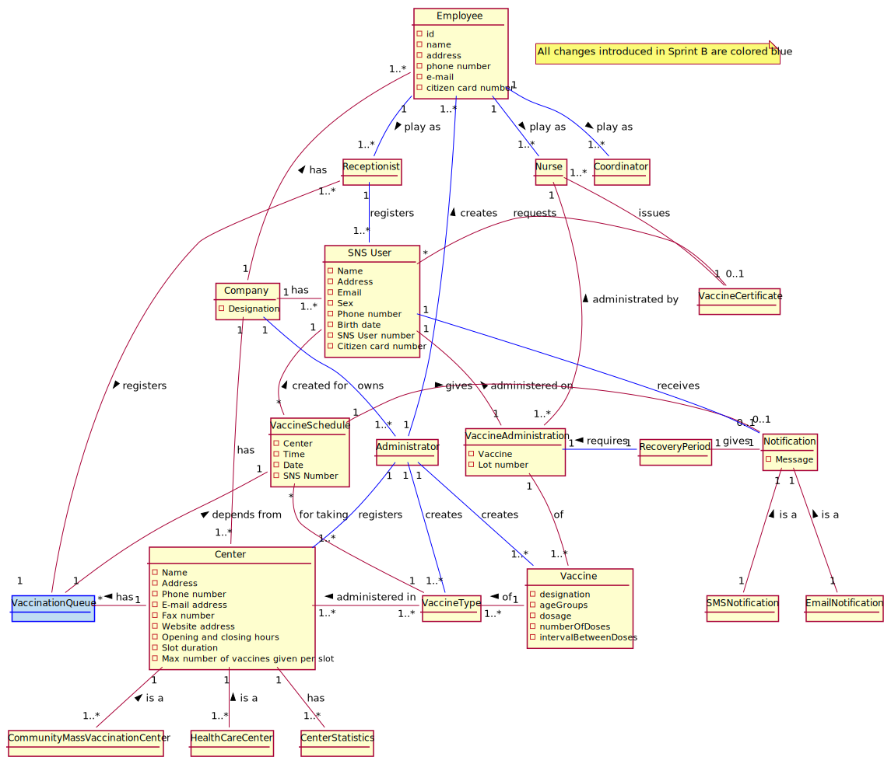

# OO Analysis #

The construction process of the domain model is based on the client specifications, especially the nouns (for _concepts_) and verbs (for _relations_) used. 

### **Conceptual Class Category List** ###

**Business Transactions**

* Vaccine Administration

---

**Transaction Line Items**

---

**Product/Service related to a Transaction or Transaction Line Item**

* Vaccine
* Notification
* Email Notification
* SMS Notification
 
---

**Transaction Records**

* Vaccine Certificate

---  

**Roles of People or Organizations**

* SNS User
* Receptionist
* Nurse
* Administrator
* Coordinator
* Employee
* Company
---

**Places**

* Community Mass Vaccination Center
* Healthcare Center
* Centers

---

**Noteworthy Events**

* Vaccine Schedule
* Vaccine Administration
* Arrival
* Notification
* Recovery period

---

**Physical Objects**

* Vaccine

---

**Descriptions of Things**

* Vaccine Type
* SMS Notification
* Email Notificaton

---

**Catalogs**

---

**Containers**

 

---

**Elements of Containers**

---

**Organizations**

---

**Other External/Collaborating Systems**

 

---

**Records of finance, work, contracts, legal matters**

---

**Financial Instruments**

 

---

**Documents mentioned/used to perform some work/**

* Center Statistics
---

###**Associations between conceptual classes**

| Concept (A) 		|  Association   	|  Concept (B) |
|----------	   		|:-------------		|:------      |
| Nurse |<ul><li>issues</li></ul> | <ul><li>Vaccine Certificate</li></ul>|
| Company |<ul><li>has</li><li>has</li><li>has</li><li>**owns**</li></ul>|<ul><li>Employee</li><li>Center</li><li>SNS User</li><li>**Administrator**</li></ul>|
| Center |<ul><li>has</li><li>has</li></ul> | <ul><li>Arrival</li><li>Center Statistics</li></ul>
| Receptionist |<ul><li>registers</li><li>**registers**</li></ul>|<ul><li>Arrival</li><li>**SNS User**</li></ul>|
| Administrator|<ul><li>**creates**</li><li>**creates**</li><li>**creates**</li><li>**registers**</li></ul>|<ul><li>**Vaccine**</li><li>**Vaccine Type**</li><li>**Employee**</li><li>**Center**</li></ul>|
| SNS User|<ul><li>requests</li><li>**receives**</li></ul>|<ul><li>VaccineCertificate</li><li>**Notification**</li></ul>|
| Community Mass Vaccination Center|<ul><li>is a</li></ul>|<ul><li>Center</li></ul>|
| Healthcare Center|<ul><li>is a</li></ul>|<ul><li>Center</li></ul>|
| Vaccine Administration |<ul><li>of</li><li>administered on</li><li>administered by</li></ul>|<ul><li>Vaccine</li><li>SNS User</li><li>Nurse</li></ul>|
| Vaccine |<ul><li>of</li></ul>|<ul><li>Vaccine Type</li></ul>|
| Vaccine Type |<ul><li>administered in</li></ul>|<ul><li>Center</li></ul>|
| Vaccine Schedule |<ul><li>created for</li><li>for taking</li><li>gives</li></ul>|<ul><li>SNS User</li><li>VaccineType</li><li>Notification</li></ul>|
| Arrival |<ul><li>depends from</li></ul>|<ul><li>VaccineSchedule</li></ul>|
| SMS Notification |<ul><li>is a</li></ul>|<ul><li>Notification</li></ul>|
| Email Notification |<ul><li>is a</li></ul>|<ul><li>Notification</li></ul>|
| Recovery Period |<ul><li>given by</li></ul>|<ul><li>VaccineAdministration</li></ul>|
| Employee |<ul><li>**plays as**</li><li>**plays as**</li><li>**plays as**</li></ul>|<ul><li>**Nurse**</li><li>**Receptionist**</li><li>**Coordinator**</li></ul>|

## Domain Model

