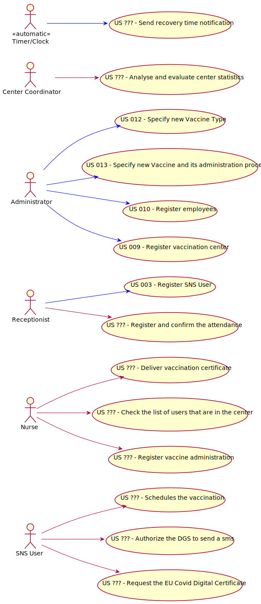

# Use Case Diagram (UCD)

# Use Cases / User Stories
| UC/US  | Description                                                                                   |                   
|:-------|:----------------------------------------------------------------------------------------------|
| US ??? | [Schedules the vaccination]()                                                                 |
| US ??? | [Help to schedule the vaccine]()                                                              |
| US ??? | [Authorize the DGS to send a sms]()                                                           |
| US ??? | [Request the EU Covid Digital Certificate]()                                                  |
| US ??? | [Deliver vaccination certificate]()                                                           |
| US ??? | [Check the list of users that are in the center]()                                            |
| US ??? | [Register vaccine administration]()                                                           |
| US ??? | [Register and confirm the attendance]()                                                       |
| US ??? | [Analyse and evaluate center statistics]()                                                    |
| US 003 | [Register SNS User]()                                                                         |
| US 009 | [Register vaccination center]()                                                               |
| US 010 | [Register employees]()
| US 012 | [Specify new Vaccine Type]()
| US 013 | [Specify new Vaccine and its administration process]()
| US ??? | [Send recovery time notification]()

