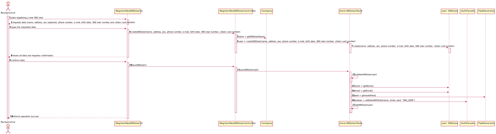

# US 003 - Receptionist : Register a SNS User

## 1. Requirements Engineering

*In this section, it is suggested to capture the requirement description and specifications as provided by the client as well as any further clarification on it. It is also suggested to capture the requirements acceptance criteria and existing dependencies to other requirements. At last, identify the involved input and output data and depicted an Actor-System interaction in order to fulfill the requirement.*

### 1.1. User Story Description

As a receptionist, I want to register an SNS User.

### 1.2. Customer Specifications and Clarifications

From the document:
> “All those who wish to use the application must be authenticated with a password holding seven alphanumeric characters, including three capital letters and two digits.”

From the client:
> **Question** What are the necessary components in order to register an SNS User?"
> 
> **Answer:** The attributes that should be used to describe a SNS user are: 
> Name, Address, Sex (optional), Phone Number, E-mail, Birth Date, SNS User Number and Citizen Card Number.  
The E-mail, Phone Number, Citizen Card Number and SNS User Number should be unique for each SNS user.

### 1.3. Acceptance Criteria

* **AC1:** The SNS user must become a system user.
* **AC2:** The password should be randomly generated. 
* **AC3:** The password should hold seven alphanumeric characters, including three capital letters and two digits.
* **AC4:** The e-mail, phone number, citizen card number and SNS User number should be unique for each SNS user.
* **AC5:** The Phone Number and the Citizen Card Number must follow the portuguese format.
### 1.4. Found out Dependencies

None found yet.

### 1.5 Input and Output Data

Input:
* SNS User Info(Name, Address, Sex (optional), Phone Number, E-mail, Birth Date, SNS User Number and Citizen Card Number)

Output:
* Confirmation on SNS User registration

### 1.6. System Sequence Diagram (SSD)

*Insert here a SSD depicting the envisioned Actor-System interactions and throughout which data is inputted and outputted to fulfill the requirement. All interactions must be numbered.*

### 1.7 Other Relevant Remarks

It is required that we use the "auth" component available in the base project, without modifying it.

## 2. OO Analysis

### 2.1. Relevant Domain Model Excerpt
*In this section, it is suggested to present an excerpt of the domain model that is seen as relevant to fulfill this requirement.*

### 2.2. Other Remarks

## 3. Design - User Story Realization

### 3.1. Rationale

**The rationale grounds on the SSD interactions and the identified input/output data.**

| Interaction ID | Question: Which class is responsible for... | Answer  | Justification (with patterns)  |
|:-------------  |:--------------------- |:------------|:---------------------------- |
| Step 1 : Starts registering a new SNS User        |... instantiating a new SNS User?| Company                      | Creator: R1/2|
|                                                   |... interacting with the actor?  | RegisterNewSNSUserUI         | Pure Fabrication |
|                                                   |... coordinating the US?         | RegisterNewSNSUserController | Pure Fabrication |
| Step 2 : requests data (name, address, sex, phone number, e-mail, birth date, SNS User number and citizen card number)               | n/a                             |                              |                  |
| Step 3 : types the requested data                 | ...saving	the data?             | SNS User                     | IE : the object knows its own data |
| Step 4 : shows all data and requests confirmation |...confirming the data locally?  | SNS User                     | IE : it knows its own data|                              |
|                                                   |...confirming the data globally? | Company                      | IE : it knows all other SNS Users |
| Step 5 : confirms data                            | ...saving the created data?     | Company                      | IE : it records all SNS User objects|
| Step 6 : informs operation success                | ...informing operation success? | RegisterNewSNSUserUI         | IE : UI is responsible for user interaction|              

### Systematization ##

According to the taken rationale, the conceptual classes promoted to software classes are:

* Company
* SNSUser

Other software classes (i.e. Pure Fabrication) identified:
* RegisterNewSNSUserUI
* RegisterNewSNSUserController

## 3.2. Sequence Diagram (SD)

*In this section, it is suggested to present an UML dynamic view stating the sequence of domain related software objects' interactions that allows to fulfill the requirement.*

## 3.3. Class Diagram (CD)

*In this section, it is suggested to present an UML static view representing the main domain related software classes that are involved in fulfilling the requirement as well as and their relations, attributes and methods.*

# 4. Tests
*In this section, it is suggested to systematize how the tests were designed to allow a correct measurement of requirements fulfilling.*

**_DO NOT COPY ALL DEVELOPED TESTS HERE_**

**Test 1:** Check that it is not possible to create an instance of the Example class with null values.

	@Test(expected = IllegalArgumentException.class)
		public void ensureNullIsNotAllowed() {
		Exemplo instance = new Exemplo(null, null);
	}

*It is also recommended to organize this content by subsections.*

# 5. Construction (Implementation)

*In this section, it is suggested to provide, if necessary, some evidence that the construction/implementation is in accordance with the previously carried out design. Furthermore, it is recommeded to mention/describe the existence of other relevant (e.g. configuration) files and highlight relevant commits.*

*It is also recommended to organize this content by subsections.*

# 6. Integration and Demo

*In this section, it is suggested to describe the efforts made to integrate this functionality with the other features of the system.*

# 7. Observations

*In this section, it is suggested to present a critical perspective on the developed work, pointing, for example, to other alternatives and or future related work.*
