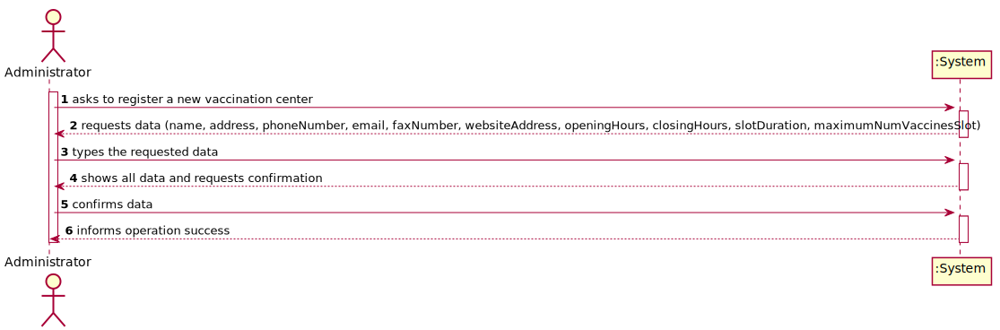

# US 006 - To create a Task 

## 1. Requirements Engineering

### 1.1. User Story Description

As an administrator, I want to register a vaccination center to respond to a certain pandemic.

### 1.2. Customer Specifications and Clarifications 

**From the specifications document:**

>"Both kinds of vaccination  centers  are  characterized  by  a  name, an address, a phone number, an e-mail address, a fax  number, a  website  address,  opening  and  closing  hours,  slot  duration (e.g.:  5 minutes) and the maximum  number  of  vaccines  that  can  be  given per slot(e.g.:  10  vaccines  per slot)".

**From the client clarifications:**

There were no client clarifications

### 1.3. Acceptance Criteria

* **AC1:** The phone number and fax number must follow the portuguese format.

### 1.4. Found out Dependencies

* n/a

### 1.5 Input and Output Data

**Input Data:**

* Typed data:
    * name
    * address
    * phone number
    * e-mail address
    * fax number
    * website address
    * opening and closing hours
    * slot duration
    * maximum number vaccines per slot
    
**Output Data:**
* (In)Success of the operation

### 1.6. System Sequence Diagram (SSD)

**Other alternatives might exist.**

### 1.7 Other Relevant Remarks

* n/a

## 2. OO Analysis

### 2.1. Relevant Domain Model Excerpt 

### 2.2. Other Remarks

n/a

## 3. Design - User Story Realization 

### 3.1. Rationale

**SSD - Alternative 1 is adopted.**

| Interaction ID                                     | Question: Which class is responsible for...  | Answer                              | Justification (with patterns)                                                                                  |
|:---------------------------------------------------|:---------------------------------------------|:------------------------------------|:---------------------------------------------------------------------------------------------------------------|
| Step 1 - asks to register a new vaccination center |	... interacting with the actor?             |  RequestVaccinationCenterUI         |  Pure Fabrication: there is no reason to assign this responsibility to any existing class in the Domain Model. |
| 			                                         |	... coordinating the US?                    |  RequestVaccinationCenterController |  Controller                                                                                                    |
| Step 2 - requests data()	                         |	n/a         			                    |                                     |                                                                                                                |
| Step 3 - types the requested data		             |	...saving the inputted data?                |  Vaccination Center                 |  IE: The object in step 1 has its own data                                                                     |
| Step 4 - shows all data and requests confirmation	 |	...validating the data locally              |  Vaccination Center                 |  IE: knows its own data                                                                                        |
|                                                    |  ...validating the data globally             |  Company                            |  IE: knows all the Vaccination Center objects                                                                  |
| Step 5 - confirms data 		                     |	...saving the registered Vaccination Center |  Company                            |  IE: records all Vaccination Center objects                                                                    |
| Step 6 - informs operation success 		         |	... informing operation success             |  UI                                 |  IE: responsible for user interaction                                                                          |

### Systematization ##

According to the taken rationale, the conceptual class promoted to software class is: 

 * Company

Other software classes (i.e. Pure Fabrication) identified: 

 * RequestVaccinationCenterUI  
 * RequestVaccinationCenterController

## 3.2. Sequence Diagram (SD)

## 3.3. Class Diagram (CD)

# 4. Tests 

**Test 1:** Check that it is not possible to register a Vaccination Centre with elements Blank. 

    @Test
    public void ensureAllBlankNotAllowed() {
        try {
            VaccinationCenterStore store = new VaccinationCenterStore();
            store.registerVaccinationCenter("", "", "", "", "", "", "", "", "", "");

        }catch (IllegalArgumentException e){
            assertNotNull(e);
        }
    }
	

**Test 2:** Check that it is not possible to register more than one Vaccination Centre with same elements.

    @Test
    public void ensureCanNotSaveDuplicateVaccinationCentres() {
        try{
            VaccinationCenterStore store = new VaccinationCenterStore();
            store.saveVaccinationCenter(store.registerVaccinationCenter("nome","address","123456789", "alguem@isep.pt", "1234567", "website.com", "20:00", "21:00", "20", "20"));
            store.saveVaccinationCenter(store.registerVaccinationCenter("nome","address","123456789", "alguem@isep.pt", "1234567", "website.com", "20:00", "21:00", "20", "20"));
        }catch (IllegalArgumentException e){
            assertNotNull(e);
        }
    }
**Test 3:** Check that it is not possible to register a Vaccination Centre with a wrong e-mail.

    @Test
    public void ensureEmailisIncorretNotAllowed() {
        try {
            VaccinationCenterStore store = new VaccinationCenterStore();
            store.registerVaccinationCenter("name", "address", "123456789", "alguem@gmailcom", "1234567", "alguem.com", "18:00", "20:00", "20", "20");
        }catch (IllegalArgumentException e){
            assertNotNull(e);
        }
    }
**Test 4:** Check that it is not possible to register a Vaccination Centre with a wrong website address.

    @Test
    public void ensureWebsiteAddressIncorrectNotAllowed(){
        try {
            VaccinationCenterStore store = new VaccinationCenterStore();
            store.registerVaccinationCenter("name", "address", "123456789", "alguem@gmail.com", "1234567", "alguemcom", "18:00", "20:00", "20", "20");
        }catch (IllegalArgumentException e){
            assertNotNull(e);
        }
    }

**Test 5:** Check that it is not possible to register a Vaccination Centre with some characteristics are the same.

    @Test
    public void validateIfSomeCharacteristicsAreTheSame(){
        ArrayList<VaccinationCenter> vaccinationCenterList = new ArrayList<>();
        vaccinationCenterList.add(new VaccinationCenter("name", "address", "123456789", "as@gmail.com", "1234567", "algo.com","20:00", "21:00", "20", "20"));
        VaccinationCenter vc = new VaccinationCenter("a", "a", "987654321", "asa@gmail.com", "7654321", "algos.com","19:00", "18:00", "19", "18");
        try {
            for (VaccinationCenter vacCen : vaccinationCenterList) {
                if ((vc.getName().equals(vacCen.getName()))) {
                    throw new IllegalArgumentException("Couldn't save. This name already exists.");
                } else if (vc.getAddress().equals(vacCen.getAddress())) {
                    throw new IllegalArgumentException("Couldn't save. This address already exists.");
                } else if (vc.getPhoneNumber().equals(vacCen.getPhoneNumber())) {
                    throw new IllegalArgumentException("Couldn't save. This phone number already exists.");
                } else if (vc.getEmail().equals(vacCen.getEmail())) {
                    throw new IllegalArgumentException("Couldn't save. This email already exists.");
                } else if (vc.getFaxNumber().equals(vacCen.getFaxNumber())) {
                    throw new IllegalArgumentException("Couldn't save. This Fax Number already exists.");
                } else if (vc.getWebsiteAddress().equals(vacCen.getWebsiteAddress())) {
                    throw new IllegalArgumentException("Couldn't save. This website address already exists.");
                }
            }
        }catch (IllegalArgumentException e){
            assertNotNull(e);
        }
    }

# 5. Construction (Implementation)

## Class RegisterVaccinationCenterController 

    public RegisterVaccinationCenterController() {
        this.app = App.getInstance();
    }

    public void registerVaccinationCenter(String name, String address, String phoneNumber, String email, String faxNumber, String websiteAddress, String openingHours, String closingHours, String slotDuration, String maximumNumVaccinesSlot) {
        store = app.getCompany().getVaccinationCenterStore();
        vc = store.registerVaccinationCenter(name, address, phoneNumber, email, faxNumber, websiteAddress, openingHours, closingHours, slotDuration, maximumNumVaccinesSlot);
    }

    public void saveVaccinationCenter() {
        store.saveVaccinationCenter(vc);
    }

}

## Class RegisterVaccinationCenterStore

    private ArrayList<VaccinationCenter> vaccinationCenterList = new ArrayList<>();

    public VaccinationCenter registerVaccinationCenter(String name, String address, String phoneNumber, String email, String faxNumber, String websiteAddress, String openingHours, String closingHours, String slotDuration, String maximumNumVaccinesSlot) {
        return (new VaccinationCenter(name, address, phoneNumber, email, faxNumber, websiteAddress, openingHours, closingHours, slotDuration, maximumNumVaccinesSlot));
    }

    public void saveVaccinationCenter(VaccinationCenter vc) {
        validateVaccinationCenter(vc);
        addVaccinationCenter(vc);
    }

    public void addVaccinationCenter(VaccinationCenter vc) {
        vaccinationCenterList.add(vc);
    }

    public void validateVaccinationCenter(VaccinationCenter vc) {
        for (VaccinationCenter vacCen : vaccinationCenterList) {
          //omitted
        }
    }

# 6. Integration and Demo 

* Empty

# 7. Observations

* Empty

