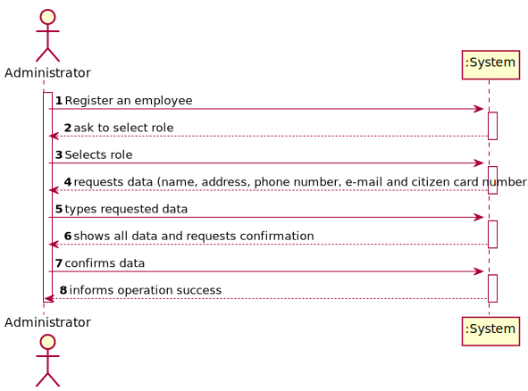
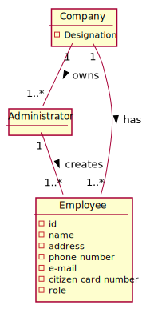
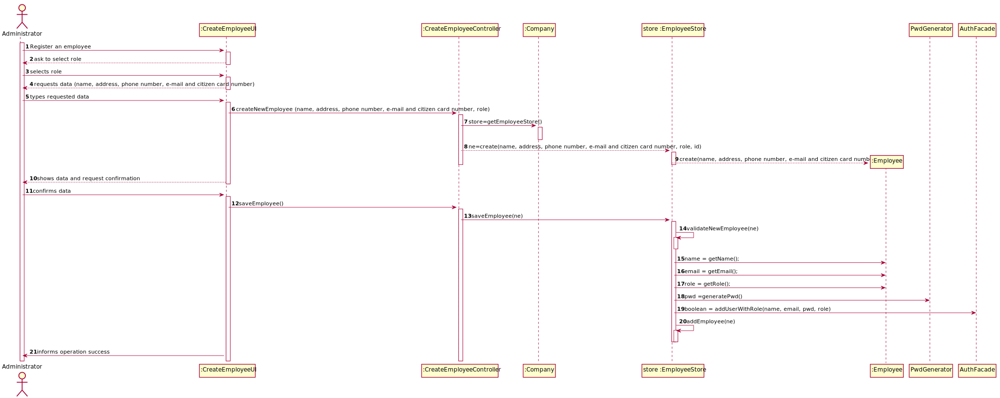
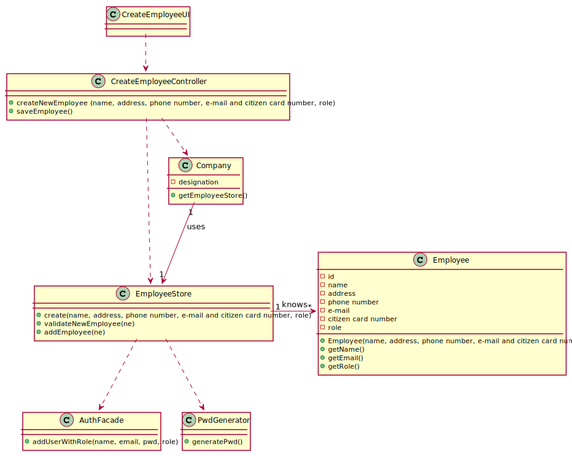

# US 010 - As an administrator, I want to register an Employee

## 1. Requirements Engineering

### 1.1. User Story Description

* As an administrator, I want to register an Employee.

      ### 1.1.2 Primary Actor
    * Administrator

  ### 1.1.3 Stakeholders and interests
    * Administrator: Wants to register an employee.

  ### 1.1.3 Preconditions
    * Administrator is identified and authenticated.
  
### 1.2. Customer Specifications and Clarifications

**From the specifications document:**

>"An Administrator is responsible for properly configuring and managing the core information (e.g.:
type of vaccines, vaccines, vaccination centers, employees) required for this application to be
operated daily by SNS users, nurses, receptionists, etc."

#### From the client clarifications:

From the document:
> “All those who wish to use the application must be authenticated with a password holding seven alphanumeric characters, including three capital letters and two digits.”

From the client:
> **Question:** Besides a password and a username, what other (if any) information should the Admin use to register a new employee? Are any of them optional?
>
> **Answer:** Every Employee has only one role (Coordinator, Receptionist, Nurse). Id (automatic), Name, address, phone number, e-mail and Citizen Card number. All attributes are mandatory.

> **Question:** What is the correct format for the employee's phone number and cc? Should we consider that these follow the portuguese format?
>
> **Answer:** Consider that these two attributes follow the portuguese format.

> **Question:** To register an employee, should we consider the email as ID or would you like to add alphanumeric or numeric ID?
> 
> **Answer:** 
### 1.3. Acceptance Criteria

From the client

* *"Each user must have a single role defined in the system. The "auth" component available on the repository must be reused (without modifications)."*

From the document:

* **AC1:** The employee must become a system user.
* **AC2:** The password should be randomly generated.
* **AC3:** The password should hold seven alphanumeric characters, including three capital letters and two digits.

### 1.4. Found out Dependencies

*Dependencies not found yet*

### 1.5 Input and Output Data

**Input Data**
* Selected data:
  * Selects the role/function.

* Typed data:
  * Name, address, phone number, e-mail and Citizen Card number, role.
  
**Output**
  * New author in the system with a defined role.
  * Confirmation on employee registration.
  * Request the data:
    * Name, address, phone number, e-mail and Citizen Card number, role.

### 1.6. System Sequence Diagram (SSD)

*Insert here a SSD depicting the envisioned Actor-System interactions and throughout which data is inputted and outputted to fulfill the requirement. All interactions must be numbered.*

### 1.7 Other Relevant Remarks

*Use this section to capture other relevant information that is related with this US such as (i) special requirements ; (ii) data and/or technology variations; (iii) how often this US is held.*

## 2. OO Analysis

### 2.1. Relevant Domain Model Excerpt
*In this section, it is suggested to present an excerpt of the domain model that is seen as relevant to fulfill this requirement.*

### 2.2. Other Remarks

*Use this section to capture some aditional notes/remarks that must be taken into consideration into the design activity. In some case, it might be usefull to add other analysis artifacts (e.g. activity or state diagrams).*

## 3. Design - User Story Realization

### 3.1. Rationale

**The rationale grounds on the SSD interactions and the identified input/output data.**

| Interaction ID                                      | Question: Which class is responsible for... | Answer              | Justification (with patterns)                                                         |
|:----------------------------------------------------|:--------------------------------------------|:--------------------|:--------------------------------------------------------------------------------------|
| Step 1- Register an employee	                       | instantiating a new Employee ?			           | Company             | Creator: R1\2                                                                         |
| Step 2- Ask to select role                          | outprint the roles?                         | CreateNewEmployeeUI | IE: responsible for user interaction                                                  |
| Step 3- Selects role                                | n/a                                         |                     |                                                                                       |
| Step 4- Requests data  		                           | n/a 							                                 |                     |                                                                                       |
| Step 5- Types requested data  		                    | saving input data?							                   | Employee            | IE: The object created in step 1 has its own data                                     |                            |                                             |          |                                                  |
| Step 6- Shows all data and requests confirmation 		 | validating the data locally					            | Employee            | IE: knows is own data                                                                 |
|                                                     | validating the data globally                | Company             | IE: knows all the employee objects                                                    |
| Step 7- Confirms data  	  	                         | saving the created employee 							         | Company             | IE: adopts/records all the Employee objects                                           |
| Step 8-Informs operation success 	                  | informing the operation success							      | CreateNewEmployeeUI | IE: responsible for user interaction                                                  |              
| Step 9  		                                          | 							                                     |                     |                                                                                       |
| Step 10  		                                         | 							                                     |                     |                                                                                       |
| Step 11 		                                          | 							                                     |                     |                                                                                       |
| Step 12  		                                         | 							                                     |                     |                                                                                       |  

### Systematization ##

According to the taken rationale, the conceptual classes promoted to software classes are:

* Company
* Employee

Other software classes (i.e. Pure Fabrication) identified:

* CreateEmployeeUI
* CreateEmployeeController

## 3.2. Sequence Diagram (SD)

*In this section, it is suggested to present an UML dynamic view stating the sequence of domain related software objects' interactions that allows to fulfill the requirement.*

## 3.3. Class Diagram (CD)

*In this section, it is suggested to present an UML static view representing the main domain related software classes that are involved in fulfilling the requirement as well as and their relations, attributes and methods.*

# 4. Tests
*In this section, it is suggested to systematize how the tests were designed to allow a correct measurement of requirements fulfilling.*

**_DO NOT COPY ALL DEVELOPED TESTS HERE_**

**Test 1:** Check that it is not possible to create an employee with name equals to blank.

    public void ensureNameisBlankNotAllowed() {
        try {
            EmployeeStore store = new EmployeeStore();
            store.createEmployee("", "qa", 123456789, "as@gmail.com", 123123123, "NURSE");
        }catch (IllegalArgumentException e){
            assertNotNull(e);
        }
    }

**Test 2:** Chechs that it is not possible to create an employee with the same Phone Number.
    
    public void validateNewEmployeeIfPhoneNumberIsTheSame(){
        ArrayList<Employee> employeeList = new ArrayList<>();
        employeeList.add(new Employee("asas", "qa", 123456789, "as@gmail.com", 123123123, "NURSE",1));
        Employee ne = new  Employee("jon", "qa", 123456789, "ass@gmail.com", 123123321, "NURSE",2);
        try {
            for (Employee emp : employeeList) {
                if (ne.getEmail().equals(emp.getEmail())){
                    throw new IllegalArgumentException("Couldn't save. This email already exists");
                }else if (ne.getPhoneNumber()==emp.getPhoneNumber()){
                    throw new IllegalArgumentException("Couldn't save. This phone number already exists");
                }else if (ne.getCitizenCardNumber()==emp.getCitizenCardNumber()){
                    throw new IllegalArgumentException("Couldn't save. This Citizen Card Number already exists");
                }
            }

        }catch (IllegalArgumentException e){
            assertNotNull(e);
        }
    }

# 5. Construction (Implementation)

*In this section, it is suggested to provide, if necessary, some evidence that the construction/implementation is in accordance with the previously carried out design. Furthermore, it is recommeded to mention/describe the existence of other relevant (e.g. configuration) files and highlight relevant commits.*

*It is also recommended to organize this content by subsections.*

**CreateEmployeeController**

    public Employee createNewEmployee(String name, String address, int phoneNumber, String email, int citizenCardNumber, String role){

        store = app.getCompany().getStoreEmployee();
        ne = store.createEmployee(name, address, phoneNumber, email, citizenCardNumber, role);
        return ne;
    }

    public void saveEmployee(){
        authFacade = app.getCompany().getAuthFacade();
        store.addEmployee(ne,authFacade);
    }

**EmployeeStore**
    
    public Employee createEmployee(String name, String address, int phoneNumber, String email, int citizenCardNumber, String role){
    this.id= employeeList.size()+1;
    return (new Employee(name, address, phoneNumber, email, citizenCardNumber, role, this.id));
    }

    public void validateNewEmployee(Employee ne){
        for (Employee emp : employeeList) {
            //omitted
        }
    }

    public void addEmployee(Employee ne, AuthFacade authFacade){

        validateNewEmployee(ne);
        String name= ne.getName();
        Email email= ne.getEmail();
        String role= ne.getRole();
        String pwd = PwdGenerator.generatePassword();
        authFacade.addUserWithRole(name, String.valueOf(email), pwd, role);
        employeeList.add(ne);

    }

# 6. Integration and Demo

*In this section, it is suggested to describe the efforts made to integrate this functionality with the other features of the system.*

# 7. Observations

*In this section, it is suggested to present a critical perspective on the developed work, pointing, for example, to other alternatives and or future related work.*

