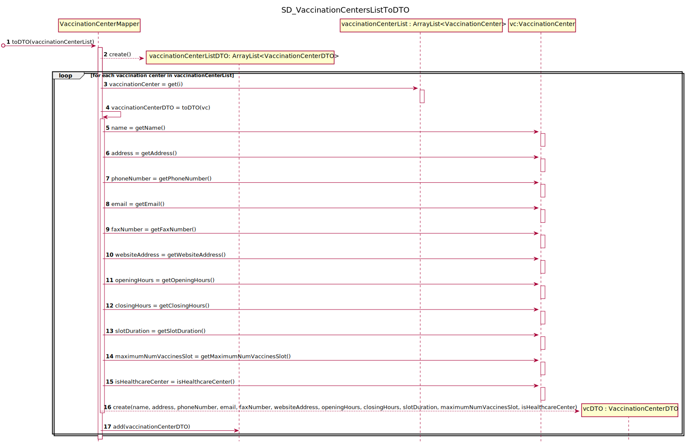
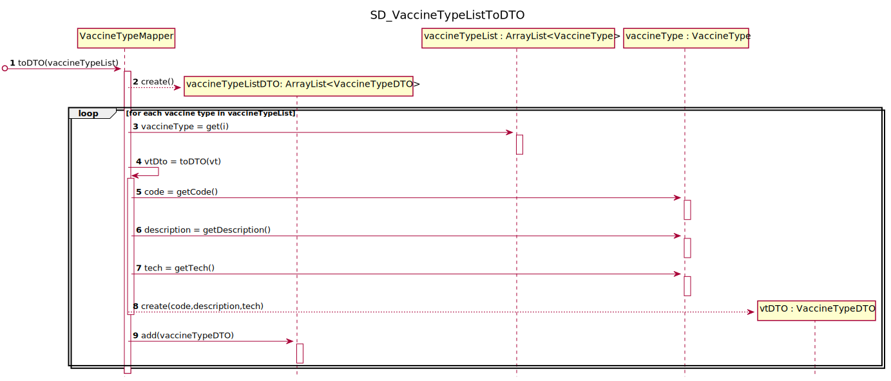

# US 002 - Receptionist: Schedule a vaccination

## 1. Requirements Engineering

### 1.1. User Story Description

As a receptionist at one vaccination center, I want to schedule a vaccination.

### 1.2. Customer Specifications and Clarifications 

**From the specifications document:**

>"The user should introduce his/her SNS user number, select the vaccination center, the date, and the time (s)he wants  to  be  vaccinatedas  well  as  the  type  of  vaccine  to  be  administered  (by default, the system suggests  the  one related  to the  ongoing  outbreak).Then,  the  application  should  check  the vaccination  center  capacity  for  that  day/timeand,  if  possible,  confirm  that  the  vaccination  is scheduled  and  inform  the  user  that (s)he  should  be  at  the  selected  vaccination  center  at  the scheduled  day  and  time.  The  SNS user may also authorize the DGS to send a SMS message with information  about  the  scheduled  appointment.  If  the  user  authorizes  the  sending of the SMS, the application should send an SMS message when the vaccination event is scheduled and registered in the system.".

**From the client clarifications:**
>**Question**:
> For the US1, the acceptance criteria is: A SNS user cannot schedule the same vaccine more than once. For the US2, the acceptance criteria is: The algorithm should check if the SNS User is within the age and time since the last vaccine.
>
> [1] Are this acceptance criteria exclusive of each US or are implemented in both?
>
> [2] To make the development of each US more clear, could you clarify the differences between the two US?"

>**Answer**:  
>[1] - The acceptance criteria for US1 and US2 should be merged. The acceptance criteria por US1 and US2 is: A SNS user cannot schedule the same vaccine more than once. The algorithm should check if the SNS User is within the age and time since the last vaccine."
>
>[2] - In US1 the actor is the SNS user, in US2 the actor is the receptionist. In US1 the SNS user is already logged in the system and information that is required and that exists in the system should be automatically obtained. In US2 the receptionist should ask the SNS user for the information needed to schedule a vaccination. Information describing the SNS user should be automatically obtained by introducing the SNS user number.

> **Question**: "We are unsure if it's in this user stories that's asked to implement the "send a SMS message with information about the scheduled appointment" found on the Project Description available in moodle. Could you clarify?"

>**Answer**: The user should receive a SMS Message to warn of a scheduling and the message should include: Date, Time and vaccination center.
> A file named SMS.txt should be used to receive/record the SMS messages. We will not use a real word service to send SMS

### 1.3. Acceptance Criteria

* **AC1** : A SNS user cannot have a vaccine scheduled more than once
* **AC2** : A receptionist cannot schedule a vaccine before the center opens or after the center closes.
* **AC3** : A receptionist cannot schedule a vaccine for the same time as another scheduling.
* **AC4** : A receptionist cannot schedule a vaccine for a specific center if the schedule limit of that center has been reached.
* **AC5** : The algorithm should check if the SNS User is within the age and time since the last vaccine(This AC couldn't be applied in Sprint C because there isn't any info registered in the system regarding the background of the user's vaccination.)

### 1.4. Found out Dependencies

From US009, US012 and US0014 : There needs to be at least one vaccination center (US009) and one vaccine type (US012) and a user (US014) in the system so that the user can schedule a vaccine

### 1.5 Input and Output Data

**Input Data:**

* Typed data:
    * SNS user number 
    * date
    * time

* Selected Data:
    * vaccination centre
    * vaccine type
    
**Output Data:**
* Confirmation on the vaccine scheduling
* SMS Message if the user chooses that option

### 1.6. System Sequence Diagram (SSD)

**Other alternatives might exist.**

### 1.7 Other Relevant Remarks

* The user should receive a SMS Message to warn of a scheduling. A txt file should be used to receive/record the SMS messages
* This user story is very similar to US002

## 2. OO Analysis

### 2.1. Relevant Domain Model Excerpt 

### 2.2. Other Remarks

There aren't any other remarks.

## 3. Design - User Story Realization 

### 3.1. Rationale

| Interaction ID                                                                                                                             | Question: Which class is responsible for...  | Answer                              | Justification (with patterns)                                                                                  |
|:-------------------------------------------------------------------------------------------------------------------------------------------|:---------------------------------------------|:------------------------------------|:---------------------------------------------------------------------------------------------------------------|
| Step 01 - Asks to schedule a vaccination                                                                                                   |	... interacting with the actor?             |  VaccineScheduleUI                  |  Pure Fabrication                                                                                              |
| 			                                                                                                                                 |	... coordinating the US?                    |  VaccineScheduleController          |  Pure Fabrication                                                                                              |
| 			                                                                                                                                 |	... instantiating a new vaccine schedule    |  Vaccine Schedule Store             |  Creator: R1/R2                                                                                                |
| Step 02 - Requests data (SNS user number)	                                                                                                 |	n/a         			                    |                                     |                                                                                                                |
| Step 03 - Types the requested data		                                                                                                 |	... saving the inputted data?               |  VaccineSchedule                    |  IE: The object knows its own data                                                                             |
| Step 04 - Shows vaccine type list                                                                                                          |	n/a                                         |                                     |                                                                                                                |
| Step 05 - Selects vaccine type                                                                                                             |	... saving the inputted option?             |  VaccineScheduleController          |  IE: It needs to know which vaccination centers to show                                                        |
|                                                                                                                                            |	... saving the inputted data?               |  VaccineSchedule                    |  IE: The object knows its own data                                                                             |
| Step 06 - Shows vaccination center list                                                                                                    |	n/a                                         |                                     |                                                                                                                |
| Step 07 - Selects vaccination center                        	                                                                             |	...saving the inputted option?              |  VaccineScheduleController          |  IE: It needs to know in which vaccination center to save the schedule                                         |
| Step 08 - Requests data (date, time)		                                                                                                 |	n/a                                         |                                     |                                                                                                                |
| Step 09 - Types the requested data	                                                                                                     |	... saving the inputted data?               |  VaccineSchedule                    |  IE: The object knows its own data                                                                             |
| Step 10 - Shows all data and requests confirmation		                                                                                 |	... confirming the data locally?            |  VaccineSchedule                    |  IE: The object knows its own data                                                                             |
|                                                                                                                                            |	... confirming the data globally?           |  VaccinationCenterStore             |  IE: It knows all vaccination centers                                                                          |
| Step 11 - Confirms data		                                                                                                             |	... saving all data?                        |  VaccineScheduleStore               |  IE: It records all vaccine schedule objects                                                                          |
| Step 12 - Informs operation success and asks if the user wishes to receive an SMS message with information about the schedule appointment. |  ... informing operation success?            |  VaccineScheduleUI                  |  IE: responsible for user interaction                                                                          |
| Step 13 - Types response		                                                                                                             |	... sending the sms notification?           |  SMSNotification                    |  IE: responsible for sending sms notifications                                                                 |
| Step 14 - Informs operation success                                                                                                        |	... informing operation success?            |  VaccineScheduleUI                  |  IE: responsible for user interaction                                                                          |

### Systematization ##

According to the taken rationale, the conceptual class promoted to software class is: 

* VaccinationCenter
* VaccinationCenterStore
* VaccineSchedule
* VaccineScheduleStore

Other software classes (i.e. Pure Fabrication) identified: 

* SNSUserVaccineScheduleUI
* SNSUserVaccineScheduleController
* Company

## 3.2. Sequence Diagram (SD)

## 3.3. Class Diagram (CD)

# 4. Tests 

**Test 1:** Check that it is not possible to schedule a vaccination at the same time as the schedule of other person

    @Test
    void ScheduleForTheSameTimeAsOtherPersonTest() throws ParseException {

        ReceptionistVaccineScheduleController vaccineScheduleController  = new ReceptionistVaccineScheduleController();

        SimpleDateFormat df = new SimpleDateFormat("dd-MM-yyyy");
        String strScheduleDate = "10-10-2027";
        String strBirthDate = "10-10-2003";
        Date dateSchedule = df.parse(strScheduleDate);
        Date dateBirth = df.parse(strBirthDate);

        SpecifyVaccineTypeController specifyVaccineTypeController = new SpecifyVaccineTypeController();
        specifyVaccineTypeController.createVaccineType("AGUA2", "asdas", "mrna");
        specifyVaccineTypeController.saveVaccineType();

        RegisterVaccinationCenterController registerVaccinationCenterController = new RegisterVaccinationCenterController();
        registerVaccinationCenterController.registerVaccinationCenter("bbbbbbbbbb", "bbbbbb", "961262446", "porto@gmail.com", "961262446", "porto.com", "10:00", "20:00", "5", "10", true);
        registerVaccinationCenterController.saveVaccinationCenter();

        UserStore store = new UserStore();
        User user = store.createUser("Pessoa", "Female", dateBirth,"Rua dos Tordos, 8",961262446 ,"madeira@gmail.com", 123456789, 333333333);
        AuthFacade authFacade = new AuthFacade();
        store.addUser(user, authFacade);

        User user2 = store.createUser("OutraPessoa", "Female", dateBirth,"Rua dos Tordos, 8",929258172 ,"funchala@gmail.com", 333333333, 929258172);
        store.addUser(user2, authFacade);

        vaccineScheduleController.obtainVaccineType(0);
        vaccineScheduleController.obtainVaccinationCenter(0);

        vaccineScheduleController.createVaccineSchedule(123456789,dateSchedule,"15:00");
        vaccineScheduleController.saveVaccineSchedule();
        vaccineScheduleController.createVaccineSchedule(333333333, dateSchedule, "15:00");

        String expectedMessage = "A schedule already exists at that time";
        try {
            vaccineScheduleController.validateVaccineSchedule();
        }catch (TimeOutOfBoundsException | DuplicateScheduleException | SchedulesListIsFullException | ScheduleAtTheSameTimeException e){
            assertTrue(expectedMessage.contains(e.getMessage()));
        }
    }
	

**Test 2:** Check that it is not possible to schedule a vaccination before the current time

    @Test
    void ScheduleBeforeTheCurrentTime() throws ParseException {

        ReceptionistVaccineScheduleController vaccineScheduleController  = new ReceptionistVaccineScheduleController();

        SimpleDateFormat df = new SimpleDateFormat("dd-MM-yyyy");
        String strScheduleDate = "10-10-2010";
        String strBirthDate = "10-10-2003";
        Date dateSchedule = df.parse(strScheduleDate);
        Date dateBirth = df.parse(strBirthDate);

        SpecifyVaccineTypeController specifyVaccineTypeController = new SpecifyVaccineTypeController();
        specifyVaccineTypeController.createVaccineType("AGUA1", "asdas", "mrna");
        specifyVaccineTypeController.saveVaccineType();

        RegisterVaccinationCenterController registerVaccinationCenterController = new RegisterVaccinationCenterController();
        registerVaccinationCenterController.registerVaccinationCenter("aaaaaaaaaaaa", "asdkase", "929258172", "madeira@gmail.com", "234234234", "madeira.com", "10:00", "20:00", "5", "10", true);
        registerVaccinationCenterController.saveVaccinationCenter();

        UserStore store = new UserStore();
        User user = store.createUser("Pessoa", "Female", dateBirth,"Rua dos Tordos, 8",932222333 ,"paulo@gmail.com", 222222222, 222222222);
        AuthFacade authFacade = new AuthFacade();
        store.addUser(user, authFacade);

        vaccineScheduleController.obtainVaccineType(0);
        vaccineScheduleController.obtainVaccinationCenter(0);

        vaccineScheduleController.createVaccineSchedule(123456789,dateSchedule,"15:00");

        String expectedMessage = "Cannot schedule a vaccination a day before today.";
        try {
            vaccineScheduleController.validateVaccineSchedule();
        }catch (TimeOutOfBoundsException | DuplicateScheduleException | SchedulesListIsFullException | ScheduleAtTheSameTimeException e){
            assertTrue(expectedMessage.contains(e.getMessage()));
        }
    }

**Test 3:** Check that it is not possible to schedule a vaccination before the opening of the vaccination center

    @Test
    void ScheduleBeforeCenterOpeningHoursTest() throws ParseException {
        ReceptionistVaccineScheduleController vaccineScheduleController  = new ReceptionistVaccineScheduleController();

        SimpleDateFormat df = new SimpleDateFormat("dd-MM-yyyy");
        String strScheduleDate = "10-10-2022";
        String strBirthDate = "10-10-2003";
        Date dateSchedule = df.parse(strScheduleDate);
        Date dateBirth = df.parse(strBirthDate);

        SpecifyVaccineTypeController specifyVaccineTypeController = new SpecifyVaccineTypeController();
        specifyVaccineTypeController.createVaccineType("12345", "asdas", "mrna");
        specifyVaccineTypeController.saveVaccineType();

        RegisterVaccinationCenterController registerVaccinationCenterController = new RegisterVaccinationCenterController();
        registerVaccinationCenterController.registerVaccinationCenter("asdads", "asdaserr", "123456789", "agua@gmail.com", "123123123", "agua.com", "10:00", "20:00", "5", "10", true);
        registerVaccinationCenterController.saveVaccinationCenter();

        UserStore store = new UserStore();
        User user = store.createUser("Pessoa", "Female", dateBirth,"Rua dos Tordos, 8",932222333 ,"paulo@gmail.com", 123456789, 312312132);
        AuthFacade authFacade = new AuthFacade();
        store.addUser(user, authFacade);

        vaccineScheduleController.obtainVaccineType(0);
        vaccineScheduleController.obtainVaccinationCenter(0);

        vaccineScheduleController.createVaccineSchedule(123456789,dateSchedule,"05:00");

        String expectedMessage = "The vaccination center isn't open at that time.";
        try {
            vaccineScheduleController.validateVaccineSchedule();
        }catch (TimeOutOfBoundsException | DuplicateScheduleException | SchedulesListIsFullException | ScheduleAtTheSameTimeException e){
            assertTrue(expectedMessage.contains(e.getMessage()));
        }
    }

# 5. Construction (Implementation)

## Class RegisterVaccinationCenterController 

    public RegisterVaccinationCenterController() {
        this.app = App.getInstance();
    }

    public void registerVaccinationCenter(String name, String address, String phoneNumber, String email, String faxNumber, String websiteAddress, String openingHours, String closingHours, String slotDuration, String maximumNumVaccinesSlot) {
        store = app.getCompany().getVaccinationCenterStore();
        vc = store.registerVaccinationCenter(name, address, phoneNumber, email, faxNumber, websiteAddress, openingHours, closingHours, slotDuration, maximumNumVaccinesSlot);
    }

    public void saveVaccinationCenter() {
        store.saveVaccinationCenter(vc);
    }

}

## Class ReceptionistVaccineScheduleController

    public class ReceptionistVaccineScheduleController {
    private App app;
    private VaccineType vaccineType;
    private VaccineTypeStore vaccineTypeStore;
    private VaccinationCenter vaccinationCenter;
    private VaccinationCenterStore vaccinationCenterStore;
    private VaccineSchedule vaccineSchedule;
    private VaccineScheduleStore vaccineScheduleStore;
    private UserStore userStore;

    public ReceptionistVaccineScheduleController(){
        this.app = App.getInstance();
        vaccinationCenterStore = app.getCompany().getVaccinationCenterStore();
        vaccineTypeStore = app.getCompany().getVaccineTypeStore();
        userStore = app.getCompany().getUserStore();
    }

    public void checkForUser(int snsNumber){
        userStore.checkForUser(snsNumber);
    }

    public ArrayList<VaccineTypeDTO> getVaccineTypeList () throws ListIsEmptyException {
        ArrayList<VaccineType> vaccineTypeList = vaccineTypeStore.getVaccineTypeList();
        if(vaccineTypeList.isEmpty()){
           throw new ListIsEmptyException("There is no vaccine type registered on the system.");
        }
        VaccineTypeMapper vaccineTypeMapper = new VaccineTypeMapper();
        return vaccineTypeMapper.toDTO(vaccineTypeList);
    }

    public void obtainVaccineType(int index){
        vaccineType = vaccineTypeStore.getVaccineTypeFromStore(index);
    }

    public ArrayList<VaccinationCenterDTO> getVaccinationCenterList () throws ListIsEmptyException {
        ArrayList<VaccinationCenter> vaccinationCenterList;
        if(!vaccineTypeStore.checkIfOngoingOutbreakIsTheChosenVaccineType(vaccineType)){
            vaccinationCenterList = vaccinationCenterStore.getHealthcareCentersList();
        }else{
            vaccinationCenterList = vaccinationCenterStore.getAllVaccinationCenters();
        }
        if(vaccinationCenterList.isEmpty()){
            throw new ListIsEmptyException("There is no vaccination centre registered on the system.");
        }
        VaccinationCenterMapper vaccinationCenterMapper = new VaccinationCenterMapper();
        return vaccinationCenterMapper.toDTO(vaccinationCenterList);
    }

    public void obtainVaccinationCenter(int index) {
        vaccinationCenter = vaccinationCenterStore.getVaccinationCenterFromStore(index,vaccineTypeStore.checkIfOngoingOutbreakIsTheChosenVaccineType(vaccineType));
    }

    public void createVaccineSchedule (int snsNumber, Date date, String time){
        VaccineScheduleDTO scheduleDTO = new VaccineScheduleDTO(snsNumber, vaccineType,date,time);
        vaccineScheduleStore = vaccinationCenter.getVaccineScheduleStore();
        vaccineSchedule = vaccineScheduleStore.createVaccineSchedule(scheduleDTO);

    }

    public void saveVaccineSchedule(){
        vaccineScheduleStore.addVaccineSchedule(vaccineSchedule);
    }

    public void validateVaccineSchedule() throws DuplicateScheduleException, SchedulesListIsFullException, TimeOutOfBoundsException, ScheduleAtTheSameTimeException {
        vaccinationCenterStore.checkForDuplicateSchedules(vaccineSchedule);
        vaccineScheduleStore.checkForMaxSchedulesQuantity(vaccineSchedule);
        vaccineScheduleStore.checkForSchedulesAtSameTime(vaccineSchedule);
        vaccineScheduleStore.checkForSchedulesOutOfCenterWorkingHours(vaccineSchedule);
        vaccineScheduleStore.checkForSchedulesBeforeNow(vaccineSchedule);
    }

    public String getScheduleInfo(){
        return ("Vaccination Center: " + vaccinationCenter.getName()+"\n"+vaccineSchedule.toString());
    }

# 6. Integration and Demo 

* Empty

# 7. Observations

* Empty

