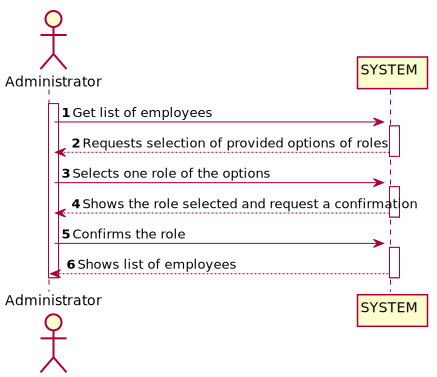
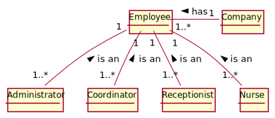
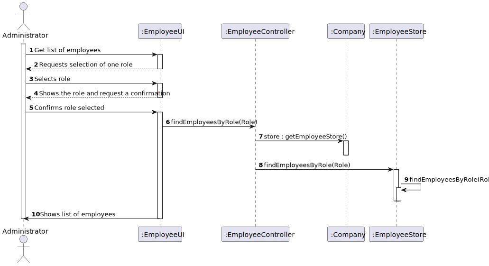
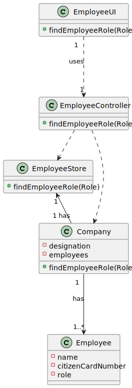

# US 011 - Administrator: Get list of employees with a given role/fucntion

## 1. Requirements Engineering

### 1.1. User Story Description

* As an administrator, I want to get a list of Employees with a given function/role.

  ### 1.1.2 Primary Actor
  * Administrator

  ### 1.1.3 Stakeholders and interests
  * Administrator: Wants accurate information, with no incorrect employees.

  ### 1.1.3 Preconditions
  * Administrator is identified and authenticated.
### 1.2. Customer Specifications and Clarifications

**From the specifications document:**

>"An Administrator is responsible for properly configuring and managing the core information (e.g.:
type of vaccines, vaccines, vaccination centers, employees) required for this application to be
operated daily by SNS users, nurses, receptionists, etc."

#### From the client clarifications:

> **Question:** Blank
>
> **Answer:** Blank

-

> **Question:** Blank
>
> **Answer:** Blank

### 1.3. Acceptance Criteria

From the client:
* "I want to see every business information from the product."

### 1.4. Found out Dependencies

*No dependencies found yet*

### 1.5 Input and Output Data

**Input Data**

* Typed data:
  * none

* Selected data:
  * Selects the role/function to list the employees.

**Output**
  * List of the employees with the selected function.

### 1.6. System Sequence Diagram (SSD)

*Insert here a SSD depicting the envisioned Actor-System interactions and throughout which data is inputted and outputted to fulfill the requirement. All interactions must be numbered.*

### 1.7 Other Relevant Remarks

*Use this section to capture other relevant information that is related with this US such as (i) special requirements ; (ii) data and/or technology variations; (iii) how often this US is held.*

## 2. OO Analysis

### 2.1. Relevant Domain Model Excerpt
*In this section, it is suggested to present an excerpt of the domain model that is seen as relevant to fulfill this requirement.*

### 2.2. Other Remarks

*Use this section to capture some aditional notes/remarks that must be taken into consideration into the design activity. In some case, it might be usefull to add other analysis artifacts (e.g. activity or state diagrams).*

## 3. Design - User Story Realization

### 3.1. Rationale

**The rationale grounds on the SSD interactions and the identified input/output data.**

| Interaction ID | Question: Which class is responsible for... | Answer  | Justification (with patterns)  |
|:-------------  |:--------------------- |:------------|:---------------------------- |
| Step 1 - See list of employees by role |				n/a			 |       EmployeesUI      | n/a|
| Step 2 - Requests the role |	Obtaining role to needed | EmployeesUI  |IE: responsible for user interaction |
| Step 3 - Confirms the role |		Get confirmation of data |  EmployeesUI   |IE: responsible for user interaction|
| Step 4 - Shows information requested|	Output the employees by role | EmployeesUI  |           n/a           |

### Systematization ##

According to the taken rationale, the conceptual classes promoted to software classes are:

* Company
* Employee

Other software classes (i.e. Pure Fabrication) identified:
* ListEmployeeUI
* ListEmployeeController

## 3.2. Sequence Diagram (SD)

*In this section, it is suggested to present an UML dynamic view stating the sequence of domain related software objects' interactions that allows to fulfill the requirement.*

## 3.3. Class Diagram (CD)

*In this section, it is suggested to present an UML static view representing the main domain related software classes that are involved in fulfilling the requirement as well as and their relations, attributes and methods.*

# 4. Tests
*In this section, it is suggested to systematize how the tests were designed to allow a correct measurement of requirements fulfilling.*

**_DO NOT COPY ALL DEVELOPED TESTS HERE_**

**Test 1:** Check that it is not possible to create an instance of the Example class with null values.

	@Test(expected = IllegalArgumentException.class)
		public void ensureNullIsNotAllowed() {
		Exemplo instance = new Exemplo(null, null);
	}

*It is also recommended to organize this content by subsections.*

# 5. Construction (Implementation)

*In this section, it is suggested to provide, if necessary, some evidence that the construction/implementation is in accordance with the previously carried out design. Furthermore, it is recommeded to mention/describe the existence of other relevant (e.g. configuration) files and highlight relevant commits.*

*It is also recommended to organize this content by subsections.*

**EmployeeStore**

    public ArrayList<Employee> findByRole(String role){
        if(role == null || role.length() == 0){
          throw new IllegalArgumentException("Role cannot be null or empty.");
        }
        ArrayList<Employee> returnList = new ArrayList<>();

        for(Employee e : employeeList){
            if(e.getRole().equals(role)){
                returnList.add(e);
            }
        }

        return returnList;
    }

**ListEmployeeController**

    public ArrayList<Employee> getListOfEmployeesByRole(String role){
      EmployeeStore employeeStore = app.getCompany().getStoreEmployee();
      return employeeStore.findByRole(role);
    }

# 6. Integration and Demo

*In this section, it is suggested to describe the efforts made to integrate this functionality with the other features of the system.*

# 7. Observations

*In this section, it is suggested to present a critical perspective on the developed work, pointing, for example, to other alternatives and or future related work.*

