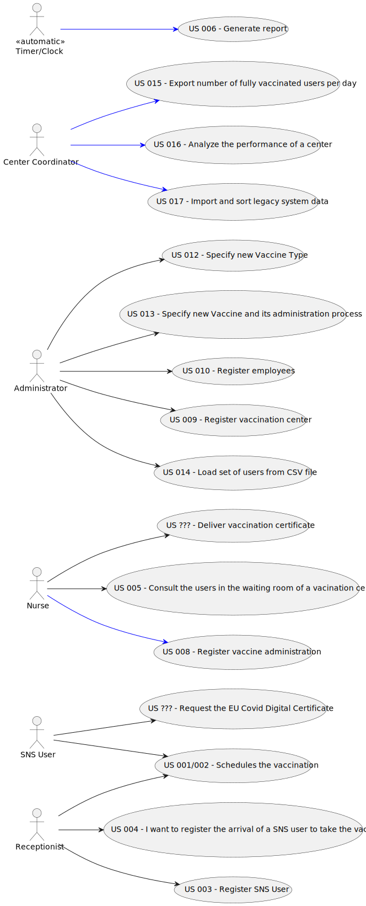

# Use Case Diagram (UCD)

# Use Cases / User Stories
| UC/US      | Description                                                          |                   
|:-----------|:---------------------------------------------------------------------|
| US 001/002 | [Schedules the vaccination]()                                        |                     |                |
| US ???     | [Request the EU Covid Digital Certificate]()                         |
| US ???     | [Deliver vaccination certificate]()                                  |
| US 005     | [Consult the users in the waiting room of a vacination center]()     |
| US ???     | [Register vaccine administration]()                                  |
| US 004     | [I want to register the arrival of a SNS user to take the vaccine]() |
| US ???     | [Analyse and evaluate center statistics]()                           |
| US 003     | [Register SNS User]()                                                |
| US 009     | [Register vaccination center]()                                      |
| US 010     | [Register employees]()                                               |
| US 012     | [Specify new Vaccine Type]()                                         |
| US 013     | [Specify new Vaccine and its administration process]()               |
| US ???     | [Send recovery time notification]()                                  |
| US 014     | [US 014 - Load set of users from CSV file]()                         |

