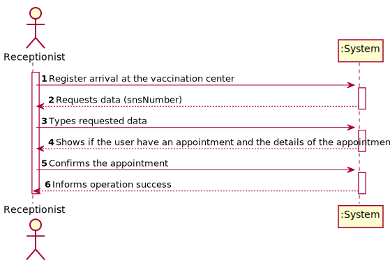

# US 004 - As a receptionist at a vaccination center, I want to register the arrival of a SNS user to take the vaccine.

## 1. Requirements Engineering

### 1.1. User Story Description

* As a receptionist at a vaccination center, I want to register the arrival of a SNS user to take the vaccine.

  ### 1.1.2 Primary Actor
    * Receptionist

  ### 1.1.3 Stakeholders and interests
    * Receptionist: Wants to register the arrival of a SNS user to take the vaccine.

  ### 1.1.3 Preconditions
    * Receptionist is identified and authenticated.
  
### 1.2. Customer Specifications and Clarifications

**From the specifications document:**

>"On the scheduled day and time, the SNS user should go to the vaccination center to get the vaccine.
When the SNS user arrives at the vaccination center, a receptionist registers the arrival of the user to
take the respective vaccine. The receptionist asks the SNS user for his/her SNS user number and
confirms that he/she has the vaccine scheduled for the that day and time. If the information is
correct, the receptionist acknowledges the system that the user is ready to take the vaccine. Then,
the receptionist should send the SNS user to a waiting room where (s)he should wait for his/her
time."

#### From the client clarifications:

From the document:
> “All those who wish to use the application must be authenticated with a password holding seven alphanumeric characters, including three capital letters and two digits.”

From the client:
> **Question:** "Regarding US04, the attribute "arrival time" should be considered to let the user enter the waiting room.
For example, a user that arrives 40 minutes after his appointment wont be allowed to enter the center, and another who only arrives 10 minutes late may proceed. If so, how much compensation time should we provide to the user."

> **Answer:** In this sprint we are not going to address the problem of delays. All arriving users are attended and registered by the receptionist.

>**Question:** "When the receptionist registers a SNSUser arrival, should we validate that the vaccination center where the SNS user arrives is the same as where the receptionist is currently working? If so, should we allocate receptionists to vaccination centers, i.e., ask the receptionist which vaccination center is she currently working at?"

> **Answer:**  To start using the application, the receptionist should first select the vaccination center where she is working. The receptionists register the arrival of a SNS user at the vaccination center where she is working.

>**Question:** "When the SNS user number is introduce by the receptionist and the system has no appointment for that SNS user number, how should the system proceed?"
> 
> **Answer:**  The application should present a message saying that the SNS user did not scheduled a vaccination.
> 
### 1.3. Acceptance Criteria

From the client

* **AC**"No duplicate entries should be possible for the same SNS user on the same day or vaccine period"*

From the document:

* **AC1:** The user must have an appointment.

### 1.4. Found out Dependencies

Depends from:
* Vaccine Schedule (US001/US002)
* Vaccination Center
* Vaccine Type

### 1.5 Input and Output Data

**Input Data**
* Selected data:
  * Selects the center

* Typed data:
  * SNS number, validation.
  
**Output**
  * Appointment Data
  * Operation success
  

### 1.6. System Sequence Diagram (SSD)

*Insert here a SSD depicting the envisioned Actor-System interactions and throughout which data is inputted and outputted to fulfill the requirement. All interactions must be numbered.*

### 1.7 Other Relevant Remarks

*Use this section to capture other relevant information that is related with this US such as (i) special requirements ; (ii) data and/or technology variations; (iii) how often this US is held.*

## 2. OO Analysis

### 2.1. Relevant Domain Model Excerpt
*In this section, it is suggested to present an excerpt of the domain model that is seen as relevant to fulfill this requirement.*

### 2.2. Other Remarks

*Use this section to capture some aditional notes/remarks that must be taken into consideration into the design activity. In some case, it might be usefull to add other analysis artifacts (e.g. activity or state diagrams).*

## 3. Design - User Story Realization

### 3.1. Rationale

**The rationale grounds on the SSD interactions and the identified input/output data.**

| Interaction ID                                                                   | Question: Which class is responsible for... | Answer                      | Justification (with patterns)                                                                  |
|:---------------------------------------------------------------------------------|:--------------------------------------------|:----------------------------|:-----------------------------------------------------------------------------------------------|
| Step 1- Register arrival at the vaccination center                               | Interacting with the user?	                 | RegisterTheArrivalUI        | Pure Fabrication                                                                               |
|                                                                                  | Coordinating the US?                        | WaitingListController       | Pure Fabrication                                                                               |
|                                                                                  | instantiating a WaitingList?                | WaitingUserStore            | Creator R1/R2                                                                                  |
| Step 2- Requests data (snsNumber)                                                | n/a                                         |                             |                                                                                                |
| Step 3- Types requested data                                                     | saving the inputted data?                   | RegisterTheArrivalContoller | IE: Because the information is needed to check an appointment and to add to waitingList        |
|                                                                                  | check if exist an appointment?              | VaccineScheduleStore        | IE: It knows all vaccination schedules                                                         |
| Step 4- Shows if the user have an appointment and the details of the appointment | 	n/a			                                     |                             |                                                                                                |
| Step 5- Confirm the appointment and type time of arrival                         | saving the data?					                       | WaitingUser                 | IE:The object knows its own data                                                               |                            |                                             |          |                                                  |
|                                                                                  | confirming the data globally?               | WaitingUserStore            | IE: It knows all WaitingUsers in the system                                                    |
|                                                                                  | saving all data?                            | WaitingUserStore            | IE: It knows all WaitingUsers in the system                                                    |
| Step 6- Informs operation success		                                              | informing operation success?  			           | RegisterTheArrivalUI        | IE: responsible for user interaction                                                           |
| Step 7-  	                                                                       | 						                                      |                             |                                                                                                |
| Step 8-	                                                                         | 					                                       |                             |                                                                                                |              
| Step 9  		                                                                       | 							                                     |                             |                                                                                                |
| Step 10  		                                                                      | 							                                     |                             |                                                                                                |
| Step 11 		                                                                       | 							                                     |                             |                                                                                                |
| Step 12  		                                                                      | 							                                     |                             |                                                                                                |  

### Systematization ##

According to the taken rationale, the conceptual classes promoted to software classes are:

* VaccinationCenter
* VaccineSchedule
* WaitingUserStore
* WaitingUser

Other software classes (i.e. Pure Fabrication) identified:

* Company
* RegisterTheArrivalUI
* RegisterTheArrivalController

## 3.2. Sequence Diagram (SD)

*In this section, it is suggested to present an UML dynamic view stating the sequence of domain related software objects' interactions that allows to fulfill the requirement.*

## 3.3. Class Diagram (CD)

*In this section, it is suggested to present an UML static view representing the main domain related software classes that are involved in fulfilling the requirement as well as and their relations, attributes and methods.*

# 4. Tests
*In this section, it is suggested to systematize how the tests were designed to allow a correct measurement of requirements fulfilling.*

**_DO NOT COPY ALL DEVELOPED TESTS HERE_**

**Test 1:** Checks that the program can detect if the appointment isn´t in the same day.
    
    @Test
    void checkWaitingList() throws ParseException {
        RegisterVaccinationCenterController registerVaccinationCenterController =new RegisterVaccinationCenterController();
        registerVaccinationCenterController.registerVaccinationCenter("nome","Morada","888888888", "alguea@isep.pt", "123458789", "websitea.com", "10:00", "21:00", "20", "20", true);
        registerVaccinationCenterController.saveVaccinationCenter();

        ReceptionistVaccineScheduleController vaccineScheduleController  = new ReceptionistVaccineScheduleController();

        SimpleDateFormat df = new SimpleDateFormat("dd-MM-yyyy");
        String strScheduleDate = "10-10-2022";
        String strBirthDate = "10-10-2003";
        Date dateSchedule = df.parse(strScheduleDate);
        Date dateBirth = df.parse(strBirthDate);

        SpecifyVaccineTypeController specifyVaccineTypeController = new SpecifyVaccineTypeController();
        specifyVaccineTypeController.createVaccineType("17345", "asdas", "mrna");
        specifyVaccineTypeController.saveVaccineType();

        UserStore store = new UserStore();
        User user = store.createUser("Pessoa", "Female", dateBirth,"Rua dos Tordos, 8",932222333 ,"paulo@gmail.com", 123456789, 312312132);
        AuthFacade authFacade = new AuthFacade();
        store.addUser(user, authFacade);

        vaccineScheduleController.obtainVaccineType(0);
        vaccineScheduleController.obtainVaccinationCenter(0);

        vaccineScheduleController.createVaccineSchedule(123456789,dateSchedule,"16:00");

        ActorCenterController actorCenterController =new ActorCenterController();
        actorCenterController.selectCenter(0);
        RegisterTheArrivalController registerTheArrivalController = new RegisterTheArrivalController();
        try {
            registerTheArrivalController.checkAppointmentList(123133123);
        } catch (NoScheduleAppointmentForSnsNumberException e) {
            assertNotNull(e);
        }
    }

**Test 2:** Checks that it isn't possible to register a User 2 times
    
    @Test
    void addWaitingList() throws ParseException {
        App app = App.getInstance();
        UserStore userStore = app.getCompany().getUserStore();
        AuthFacade authFacade = app.getCompany().getAuthFacade();

        RegisterVaccinationCenterController registerVaccinationCenterController =new RegisterVaccinationCenterController();
        registerVaccinationCenterController.registerVaccinationCenter("as","address","123456321", "pedro@isep.pt", "123456798", "www.com", "10:00", "21:00", "20", "20", true);
        registerVaccinationCenterController.saveVaccinationCenter();

        ActorCenterController actorCenterController =new ActorCenterController();
        actorCenterController.selectCenter(0);
        RegisterTheArrivalController registerTheArrivalController = new RegisterTheArrivalController();

        SimpleDateFormat df = new SimpleDateFormat("dd-MM-yyyy");
        String strBirthDate = "10-10-2003";
        Date dateBirth = df.parse(strBirthDate);
        userStore.addUser(userStore.createUser("Pessoa", "Female", dateBirth,"Rua dos Tordos, 8",932222333 ,"paulo@gmail.com", 123456789, 312312132), authFacade);
        try {
            registerTheArrivalController.addWaitingUser(123456789);
        } catch (UserIsAlreadyInTheWaitingListException e) {
            assertNull(e);
        }
        try {
            registerTheArrivalController.addWaitingUser(123456789);
        } catch (UserIsAlreadyInTheWaitingListException e) {
            assertNotNull(e);
        }

    }
}

# 5. Construction (Implementation)

*In this section, it is suggested to provide, if necessary, some evidence that the construction/implementation is in accordance with the previously carried out design. Furthermore, it is recommeded to mention/describe the existence of other relevant (e.g. configuration) files and highlight relevant commits.*

*It is also recommended to organize this content by subsections.*

**RegisterTheArrivalController**

    private App app;
    private VaccinationCenter actorCenter;

    public RegisterTheArrivalController() {
        this.app=  App.getInstance();
        this.actorCenter = app.getCompany().getActorCenter();
    }

    public VaccineScheduleDTO checkAppointmentList(int snsNumber) throws NoScheduleAppointmentForSnsNumberException {
        VaccineScheduleStore vaccineScheduleStore = this.actorCenter.getVaccineScheduleStore();
        VaccineScheduleDTO dtoSchedule = vaccineScheduleStore.checkIfThereIsAnAppointment(snsNumber);
        if (dtoSchedule == null){
            throw new NoScheduleAppointmentForSnsNumberException();
        }
        return  dtoSchedule;
    }

    public void addWaitingUser(int snsNumber) throws UserIsAlreadyInTheWaitingListException {

        UserStore userStore = app.getCompany().getUserStore();
        WaitingUserStore storeWaitingUser= this.actorCenter.getWaitingUserStore();
        storeWaitingUser.createWaitingUserList(snsNumber,userStore);
    }

**WaitingUserStore**
    
     private ArrayList<WaitingUser> waitingUsersList = new ArrayList<>();

    public void createWaitingUserList(int snsNumber, UserStore userStore) throws MissingUserException, UserIsAlreadyInTheWaitingListException {
        User user = userStore.getUserBySnsNumber(snsNumber);
        if(user == null){
            throw new MissingUserException();
        }
        WaitingUser waitingUser = new WaitingUser(user,Time.currentTime());

        validateWaitingUserList(waitingUser);

        addtoWaitingUserList(waitingUser);
    }

    public void validateWaitingUserList(WaitingUser waitingUser) throws UserIsAlreadyInTheWaitingListException {
        if(waitingUsersList.size()!=0){
            for(WaitingUser i : waitingUsersList){
                if (i.isEquals(waitingUser)){
                    throw new UserIsAlreadyInTheWaitingListException();
                }
            }
        }
    }

    public void addtoWaitingUserList(WaitingUser waitingUser){
        waitingUsersList.add(waitingUser);
    }

# 6. Integration and Demo

*In this section, it is suggested to describe the efforts made to integrate this functionality with the other features of the system.*

# 7. Observations

*In this section, it is suggested to present a critical perspective on the developed work, pointing, for example, to other alternatives and or future related work.*

