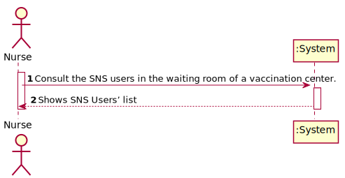
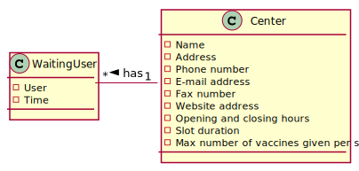
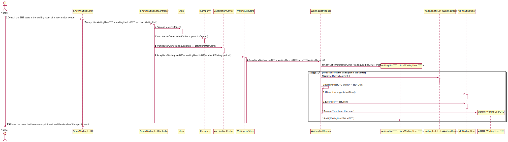
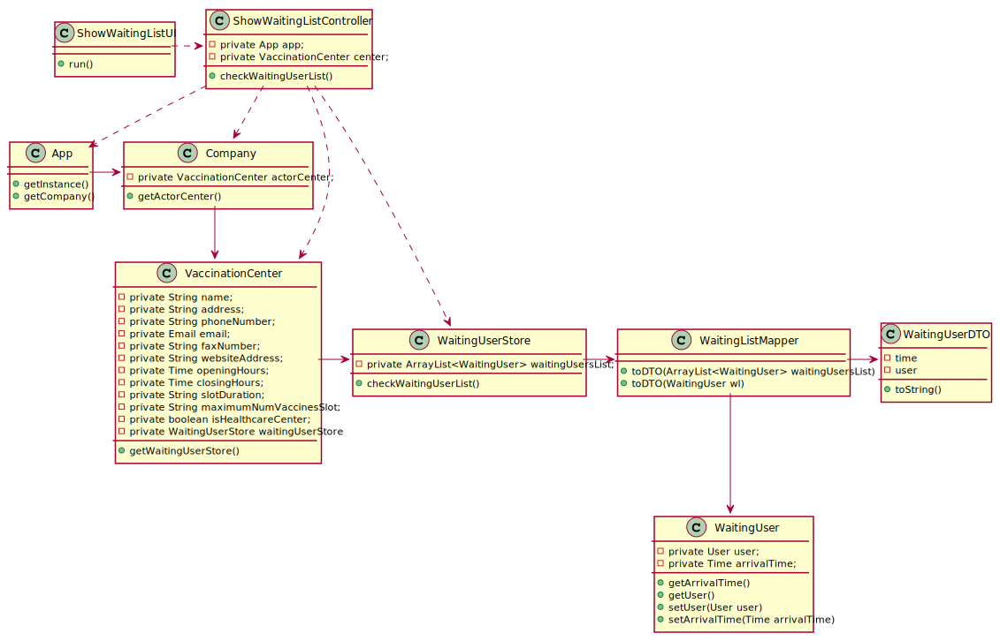

# US 005 - Nurse : Consult the users in the waiting room of a vacination center

## 1. Requirements Engineering

### 1.1. User Story Description

* As a nurse, I intend to consult the users in the waiting room of a vacination center*

  ### 1.1.2 Primary Actor
    * Nurse

  ### 1.1.3 Stakeholders and interests
    * Nurse: Wants to consult the users in the waiting room of a vacination center.

  ### 1.1.3 Preconditions
    * Nurse is identified and authenticated.
    
### 1.2. Customer Specifications and Clarifications

**From the document:**

>"a nurse responsible for administering the vaccine will use the application to check the
list of SNS users that are present in the vaccination center to take the vaccine"

**From the client:**

>**Question:**
> Dear client, What information about the Users (name, SNS number, etc) should the system display when listing them?
>
>Regards

> **Answer:**
> Dear student,
> 
>Name, Sex, Birth Date, SNS User Number and Phone Number.
> 
>Best regards, 
> 
>Carlos Ferreira

>**Question:**
>Dear Client, 
>
>1 - We need to know if the nurse have to choose the vaccination center before executing the list or if that information comes from employee file?
>
>Best regards

>**Answer:**
>Dear student,
> 
> When the nurse starts to use the application, firstly, the nurse should select the vaccination center where she his working. The nurse wants to check the list of SNS users that are waiting in the vaccination center where she his working.
> 
> Best regards,
>
>Carlos Ferreira

>**Question:**
>Dear client,
>
>I would like to know which are the attributes of the waiting room.
>
>Best wishes,

>**Answer:**
>Dear student,
>
>The waiting room will not be registered or defined in the system. The waiting room of each vaccination center has the capacity to receive all users who take the vaccine on given slot.
>
>Best regards,
>
>Carlos Ferreira

### 1.3. Acceptance Criteria

* **AC1:** : Waiting Users’ list should be presented by order of arrival.
* **AC2:** : Waiting Users’ list should be corresponded to the vaccination center where the nurse works
* **AC3** :  The system should display when listing the SNS Users’ list: User's Name, Sex, Birth Date, SNS User Number and Phone Number
* **AC4** : The nurse should select, when starts to use the application, the vaccination center where she is working

### 1.4. Found out Dependencies

*The record of the arrival of an SNS user to take the vaccine.*

### 1.5 Input and Output Data

**Input**

* none

**Output:**

* Waiting Users’ list

### 1.6. System Sequence Diagram (SSD)

### 1.7 Other Relevant Remarks

Non-Functional Requirements founded:

Usability:
For this nurse functionality, we have an easy user interface to use for the nurse.

Capacity:
The system only allow nurses to see the list of Waiting User on their vaccination centers work

## 2. OO Analysis

### 2.1. Relevant Domain Model Excerpt

### 2.2. Other Remarks

## 3. Design - User Story Realization

### 3.1. Rationale

| Interaction ID | Question: Which class is responsible for... | Answer  | Justification (with patterns)  |
|:-------------  |:--------------------- |:------------|:---------------------------- |
| Step 1 : Consult the SNS users in the waiting room of a vaccination center.   | n/a |ShowWaitingListUI|  n/a |
| Step 2 : Shows SNS Users’ list | Output: list of SNS users in the wainting room | ShowWaitingListUI | n/a |

### Systematization ##

According to the taken rationale, the conceptual classes promoted to software classes are:

* VaccinationCenterStore
* WaitingUserStore

Other software classes (i.e. Pure Fabrication) identified:
* ShowWaitingListUI
* ShowWaitingListController
* Company
* App
* WaitingUserMapper
* WaitingUserDTO

## 3.2. Sequence Diagram (SD)

## 3.3. Class Diagram (CD)

# 4. Tests

**Test 1:** Check that it is not possible to create an instance of the Example class with an Empty List.

    @Test
    void checkWaitingUserList() throws ParseException, ListIsEmptyException {
        ShowWaitingListController showWaitingListController = new ShowWaitingListController();

        RegisterVaccinationCenterController registerVaccinationCenterController =new RegisterVaccinationCenterController();
        registerVaccinationCenterController.registerVaccinationCenter("persona2","moradinha","123456349", "isso@isep.pt", "123456789", "isep.pt", "10:00", "21:00", "20", "20", true);
        registerVaccinationCenterController.saveVaccinationCenter();

        ActorCenterController actorCenterController =new ActorCenterController();
        ArrayList<VaccinationCenterDTO> vaccinationCenterDTOS = actorCenterController.getActorCenter();
        actorCenterController.selectCenter(0);

        WaitingUserStore waitingUserStore = new WaitingUserStore();

        UserStore userStore = new UserStore();
        SimpleDateFormat df = new SimpleDateFormat("dd-MM-yyyy");

        String strBirthDate = "28-05-2003";
        Date dateBirth = df.parse(strBirthDate);

        User user= userStore.createUser("Pessoa","Male",dateBirth,"Rua",934746524,"a@a.pt",756567576,567868678);
        AuthFacade authFacade = new AuthFacade();
        userStore.addUser(user, authFacade);

        Time time = new Time(20,20);

        WaitingUser waitingUser = new WaitingUser(user,time);

        waitingUserStore.addtoWaitingUserList(waitingUser);

        try {
            ArrayList<WaitingUserDTO> waitingUserDTO= showWaitingListController.checkWaitingUserList();
        } catch (ListIsEmptyException e) {
            assertNotNull(e);
        }
    }

*It is also recommended to organize this content by subsections.*

# 5. Construction (Implementation)

## Class ShowWaitingListController 

    /**
     * This method gets the Waiting User Store and request the Store to check the existence of a Waiting Users List, if it exists it returns the List
     * @return waitingUsersListDTO
     * @throws ListIsEmptyException
     */

    public ArrayList<WaitingUserDTO> checkWaitingUserList() throws ListIsEmptyException {
        this.app=  App.getInstance();
        this.center = app.getCompany().getActorCenter();
        WaitingUserStore waitingUserStore = center.getWaitingUserStore();
        return waitingUserStore.checkWaitingUserList();
    }

## Class WaitingUserStore

    /**
     * This method checks for the existence of a Waiting User List, if it exists it returns the list from a DTO
     * @return  waitingUsersListDTO
     * @throws ListIsEmptyException
     */

    public ArrayList<WaitingUserDTO> checkWaitingUserList() throws ListIsEmptyException {
        if (!waitingUsersList.isEmpty()) {
            WaitingUserMapper Mapper = new WaitingUserMapper();
            return Mapper.toDTO(waitingUsersList);
        }
        else{
            throw new ListIsEmptyException("There is no waiting list registered on the system.");
        }
    }

## Class WaitingUserMapper

    /**
     * This method transform the Array List of Waiting User objects into Array List of Waiting Users DTO objects
     * @param  waitingUsersList
     * @return  waitingUsersListDTO
     */

    public  ArrayList<WaitingUserDTO> toDTO(ArrayList<WaitingUser> waitingUsersList) {
        ArrayList<WaitingUserDTO> waitingUsersListDTO = new ArrayList<>();
            for (int i=0; i<waitingUsersList.size(); i++){
                WaitingUser wl = waitingUsersList.get(i);
                WaitingUserDTO wlDTO= toDTO(wl);
                waitingUsersListDTO.add(wlDTO);
            }
            return waitingUsersListDTO;

    }

    /**
     * This method transform the Waiting User object on a Waiting User DTO object
     * @param wl
     * @return WaitingUserDTO
     */

    private WaitingUserDTO toDTO(WaitingUser wl){
        Time time= wl.getArrivalTime();
        User user= wl.getUser();
        return new WaitingUserDTO(time,user);
    }

# 6. Integration and Demo

* A new menu options was added to employed nurses.
* Added "Show waiting users’ list in the waiting room" option

# 7. Observations

*In this section, it is suggested to present a critical perspective on the developed work, pointing, for example, to other alternatives and or future related work.*
