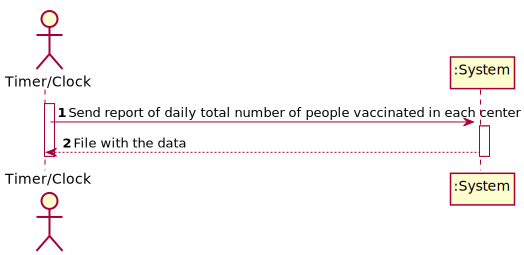
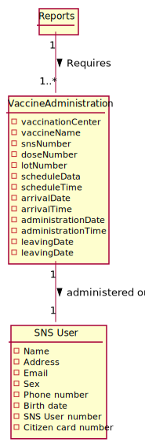
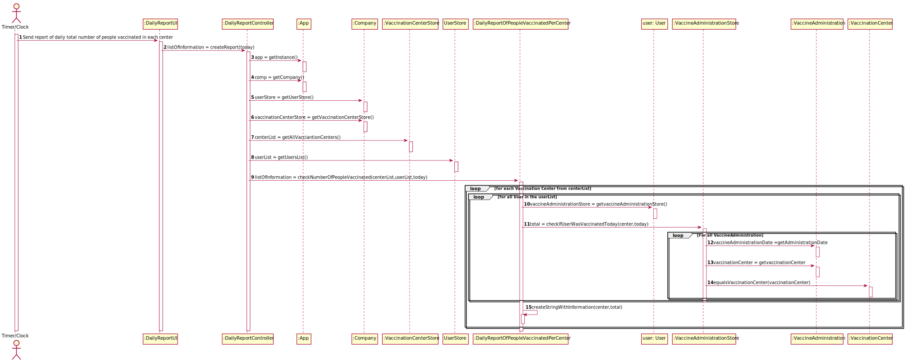
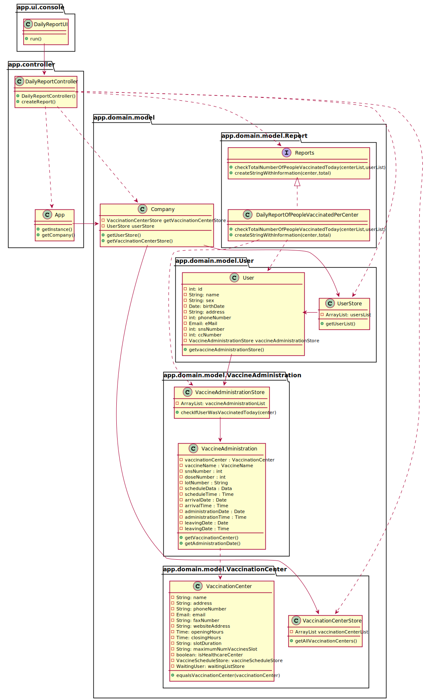

# US 004 - DGS wants to record daily the total number of people vaccinated in each vaccination center.

## 1. Requirements Engineering

### 1.1. User Story Description

*DGS wants to record daily the total number of people vaccinated in each vaccination center*.

  ### 1.1.2 Primary Actor
    * «automatic» Timer/Clock

  ### 1.1.3 Stakeholders and interests
    * DGS:wants to record daily the total nummber of people vaccinated in each vaccination center.

  ### 1.1.3 Preconditions
    * There needs to exist a time in the config file so the daily record can work.
  
### 1.2. Customer Specifications and Clarifications

**From the specifications document:**

>

#### From the client clarifications:

From the document:
>
>
From the client:
> **Question:** "In the acceptance criteria, "the algorithm should run automatically at a time defined in a configuration file and should register a date, the name of the vaccination center and the total number of vaccinated users." How it is supposed to register this information? Should it be recorded in a file (ex: txt,..) or recorded in the system (ex: in a store) ?"
> **Answer:** The data should be written to a CSV file (field delimiter should be a semicolon).
> **Question:** After asking you to be more clear with your answer to my previous questions, you said that we can either access directly the "vaccinations report" file or create the option for center coordinators and administrators to view it's content, is this correct?"
> **Answer:** You misunderstood, I didn't say that. The file should be available in the file system and anyone having access to the file system can read the file contents.
>**Question:** We would like to know which kind of user (Administrator, Nurse...) is supposed to have access to the file generated by the system.
> **Answer:** Someone from DGS.
> **Question:** "As per the acceptance criteria, can the job be deployed manualy by a specific actor like Receptionist, Administrator,...? Who does the initial configuration for the automatic job?"
> **Answer** The algorithm should run automatically at a time defined in a configuration file and should register the date, the name of the vaccination center and the total number of vaccinated users.
> 
### 1.3. Acceptance Criteria

From the client

* **AC** The algorithm should run automatically at a time defined in a configuration file and should register the date, the name of the vaccination center and the total number of vaccinated users.

From the document:

### 1.4. Found out Dependencies

Depends from:
* Vaccine Administration

### 1.5 Input and Output Data

**Input Data**

**Output**
  * File with the data(Name of the Vaccination center, date, and total number of vaccinated users)
  
  

### 1.6. System Sequence Diagram (SSD)

*Insert here a SSD depicting the envisioned Actor-System interactions and throughout which data is inputted and outputted to fulfill the requirement. All interactions must be numbered.*

### 1.7 Other Relevant Remarks

*Use this section to capture other relevant information that is related with this US such as (i) special requirements ; (ii) data and/or technology variations; (iii) how often this US is held.*

## 2. OO Analysis

### 2.1. Relevant Domain Model Excerpt
*In this section, it is suggested to present an excerpt of the domain model that is seen as relevant to fulfill this requirement.*

### 2.2. Other Remarks

*Use this section to capture some aditional notes/remarks that must be taken into consideration into the design activity. In some case, it might be usefull to add other analysis artifacts (e.g. activity or state diagrams).*

## 3. Design - User Story Realization

### 3.1. Rationale

**The rationale grounds on the SSD interactions and the identified input/output data.**

| Interaction ID                                                                | Question: Which class is responsible for... | Answer               | Justification (with patterns)                     |
|:------------------------------------------------------------------------------|:--------------------------------------------|:---------------------|:--------------------------------------------------|
| Step 1- Send report of daily total number of people vaccinated in each center | Interacting with the user?	                 |DailyReportUI  | Pure Fabrication                                  |
|                                                                               | Checking If the user were vaccinated?       | :VaccineAdministrationStore                     | IE: Because she knows all Vaccine Administrations |
| Step 2- File with the data                                                                      | Writting to the file ?                      | DailyReportUI                     | Pure Fabrication                                                  |
| Step 4-                                                                       | 			                                         |                      |                                                   |
| Step 5-                                                                       | 				                                        |                      |                                                   |                            |                                             |          |                                                  |
| Step 6- 		                                                                    | 			                                         |                      |                                                   |
| Step 7-  	                                                                    | 						                                      |                      |                                                   |
| Step 8-	                                                                      | 					                                       |                      |                                                   |              
| Step 9  		                                                                    | 							                                     |                      |                                                   |
| Step 10  		                                                                   | 							                                     |                      |                                                   |
| Step 11 		                                                                    | 							                                     |                      |                                                   |
| Step 12  		                                                                   | 							                                     |                      |                                                   |  

### Systematization ##

According to the taken rationale, the conceptual classes promoted to software classes are:

* User
* VaccineAdministration

Other software classes (i.e. Pure Fabrication) identified:

* Company
* DailyReportUI
* DailyReportController

## 3.2. Sequence Diagram (SD)

*In this section, it is suggested to present an UML dynamic view stating the sequence of domain related software objects' interactions that allows to fulfill the requirement.*

## 3.3. Class Diagram (CD)

*In this section, it is suggested to present an UML static view representing the main domain related software classes that are involved in fulfilling the requirement as well as and their relations, attributes and methods.*

# 4. Tests
*In this section, it is suggested to systematize how the tests were designed to allow a correct measurement of requirements fulfilling.*

**_DO NOT COPY ALL DEVELOPED TESTS HERE_**

**Test 1:** Checks If the program detects if there isn´t any centers or users in the system.

    @Test
    void createReport() {

        DailyReportController controller = new DailyReportController();
        Calendar today = Calendar.getInstance();
        today.set(Calendar.HOUR_OF_DAY, 0);
        try {
            controller.createReport(today);
        } catch (ListIsEmptyException e) {
            assertNotNull(e);
        } catch (ClassNotFoundException e) {
            assertNull(e);
        } catch (InstantiationException e) {
            assertNull(e);
        } catch (IllegalAccessException e) {
            assertNull(e);
        }

    }

**Test 2:** Checks if the counting per center is correct
    
     @Test
    void checkNumberOfPeopleVaccinated() throws ParseException {

        SimpleDateFormat df = new SimpleDateFormat("dd-MM-yyyy");
        String strBirthDate = "10-10-2003";
        Date dateBirth = df.parse(strBirthDate);

        UserStore store = new UserStore();
        User user1 = store.createUser("Pessoa1", "Female", dateBirth,"Rua dos Tordos, 8",932222333 ,"paulo@gmail.com", 123456789, 31231213);
        User user2 = store.createUser("Pessoa2", "Female", dateBirth,"Rua dos Tordos, 8",932222334 ,"paulo@gmail.com", 123456788, 31231212);
        User user3 = store.createUser("Pessoa3", "Female", dateBirth,"Rua dos Tordos, 8",932222335 ,"paulo@gmail.com", 123456787, 31231211);
        User user4 = store.createUser("Pessoa4", "Female", dateBirth,"Rua dos Tordos, 8",932222336 ,"paulo@gmail.com", 123456786, 31231210);

        ArrayList<Integer> ageGroup = new ArrayList<>(Arrays.asList(1, 2, 3, 4));
        ArrayList<Integer> interval = new ArrayList<>(Arrays.asList(1));
        ArrayList<Double> dosage = new ArrayList<>(Arrays.asList(1.2,3.4,5.6,6.7));
        Vaccine v = new Vaccine(new VaccineTypeDTO("12345","a","mrna"),"pfizer",2,ageGroup,dosage,2,interval);

        Calendar today = Calendar.getInstance();
        today.set(Calendar.HOUR_OF_DAY, 0);

        Date date = df.parse("10-10-2022");
        today.setTime(date);
        VaccinationCenter vc1 = new VaccinationCenter("Centro1", "Rua1", "121212121", "w@w.com", "121212121", "w.com", "10:00", "20:00", "5", "10", true);
        VaccinationCenter vc2 = new VaccinationCenter("Centro2","Rua2","123321123", "c1@gmail.com", "123321123", "c1.com","08:00","20:00","5","10",true);
        VaccineAdministration va1 = new VaccineAdministration(vc1,v,111111111,1,"12345-12","AAAA",date,new Time("8:00"), date,new Time("8:00"), date, new Time("8:15"), date, new Time("8:45"));
        VaccineAdministration va2 = new VaccineAdministration(vc1,v,222222222,1,"12345-12","BBBB",date,new Time("8:00"), date,new Time("8:01"), date, new Time("8:16"), date, new Time("8:46"));
        VaccineAdministration va3 = new VaccineAdministration(vc2,v,333333333,1,"12345-12","CCCC",date,new Time("8:00"), date,new Time("8:02"), date, new Time("8:17"), date, new Time("8:47"));
        VaccineAdministration va4 = new VaccineAdministration(vc2,v,444444444,1,"12345-12","DDDD",date,new Time("8:00"), date,new Time("8:03"), date, new Time("8:18"), date, new Time("8:48"));

        user1.saveNewVaccineAdministration(va1);
        user2.saveNewVaccineAdministration(va2);
        user3.saveNewVaccineAdministration(va3);
        user4.saveNewVaccineAdministration(va4);

        ArrayList<User> userArrayList= new ArrayList<>(Arrays.asList(user1, user2, user3, user4));
        ArrayList<VaccinationCenter> vaccinationCenterArrayList= new ArrayList<>(Arrays.asList(vc1, vc2));

        DailyReportOfPeopleVaccinatedPerCenter dailyReportOfPeopleVaccinatedPerCenter= new DailyReportOfPeopleVaccinatedPerCenter();
        ArrayList<String> info =dailyReportOfPeopleVaccinatedPerCenter.checkNumberOfPeopleVaccinated(vaccinationCenterArrayList,userArrayList,today);

        String data = "10-10-2022";
        String vc1Data = "Centro1 = 2";
        String vc2Data = "Centro2 = 2";
        assertEquals(info.get(0),data);
        assertEquals(info.get(1),vc1Data);
        assertEquals(info.get(2),vc2Data);

    }

# 5. Construction (Implementation)

*In this section, it is suggested to provide, if necessary, some evidence that the construction/implementation is in accordance with the previously carried out design. Furthermore, it is recommeded to mention/describe the existence of other relevant (e.g. configuration) files and highlight relevant commits.*

*It is also recommended to organize this content by subsections.*

**DailyReportController**

      public ArrayList<String> createReport(Calendar today) throws ListIsEmptyException, ClassNotFoundException, InstantiationException, IllegalAccessException {
       App app = App.getInstance();
       Company comp = app.getCompany();
        UserStore userStore = comp.getUserStore();
        VaccinationCenterStore vaccinationCenterStore = comp.getVaccinationCenterStore();
        ArrayList<VaccinationCenter> centerList = vaccinationCenterStore.getAllVaccinationCenters();
        ArrayList<User> userList = userStore.getUsersList();

        if(centerList.size()==0 && userList.size()==0){
            throw new ListIsEmptyException("There isn't any Vaccination centers and Users in the system");
        }else if(centerList.size()==0){
            throw new ListIsEmptyException("There isn't any Vaccination centers in the system");
        }else if(userList.size()==0){
            throw new ListIsEmptyException("There isn't any Users in the system");
        }

        Properties props = new Properties();
        try
        {
            InputStream in = new FileInputStream(Constants.PARAMS_FILENAME);
            props.load(in);
            in.close();
            String className = props.getProperty(Constants.PARAMS_REPORT_METHOD_DESIGNATION);
            if (className != null ) {
                Class<?> oClass = Class.forName("app.domain.model.Report." + className);
                Report report = (Report) oClass.newInstance();
                return report.checkNumberOfPeopleVaccinated(centerList, userList, today);
            }
        }
        catch(IOException ex)
        {
        }

        return null;
    }

**DailyReportOfPeopleVaccinatedPerCenter**

    @Override

    public ArrayList<String> checkNumberOfPeopleVaccinated(ArrayList<VaccinationCenter> centerList, ArrayList<User> userList, Calendar today) {
    ArrayList<String> listOfInformation = new ArrayList<>();
    int total;
    int contador;
    listOfInformation.add(today.get(Calendar.DAY_OF_MONTH) + "-" + (today.get(Calendar.MONTH)+1) +"-" + today.get(Calendar.YEAR));
    for( VaccinationCenter center: centerList){
    total=0;
    for(User user: userList){
    VaccineAdministrationStore vaccineAdministrationStore = user.getVaccineAdministrationStore();
    contador = vaccineAdministrationStore.checkIfUserWasVaccinatedToday(center, today);
    total= total +contador;
    }
    listOfInformation.add(createStringWithInformation(center,total));
    }
    return listOfInformation;
    }
    public String createStringWithInformation(VaccinationCenter center, int total) {
        return center.getName() +" = " + total;
    }
    } 
     

# 6. Integration and Demo

*In this section, it is suggested to describe the efforts made to integrate this functionality with the other features of the system.*

# 7. Observations

*In this section, it is suggested to present a critical perspective on the developed work, pointing, for example, to other alternatives and or future related work.*

