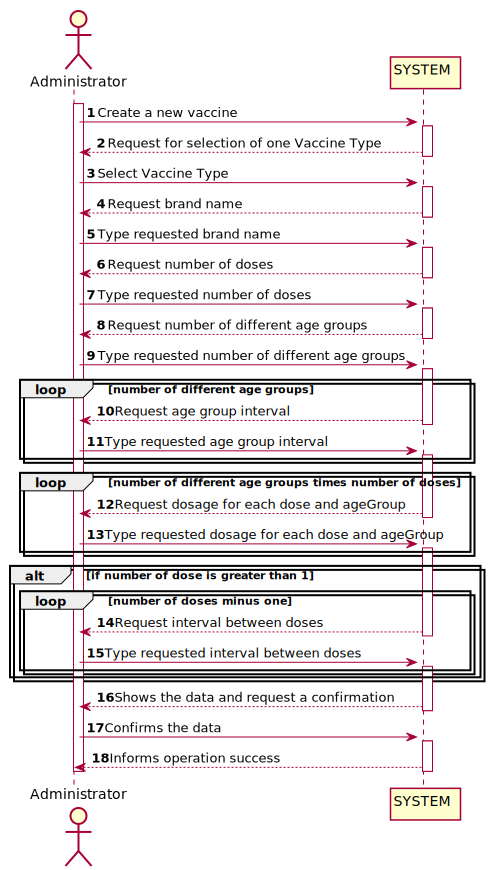
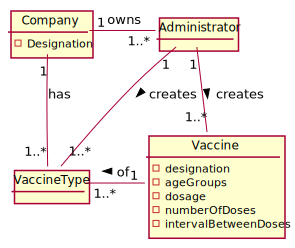
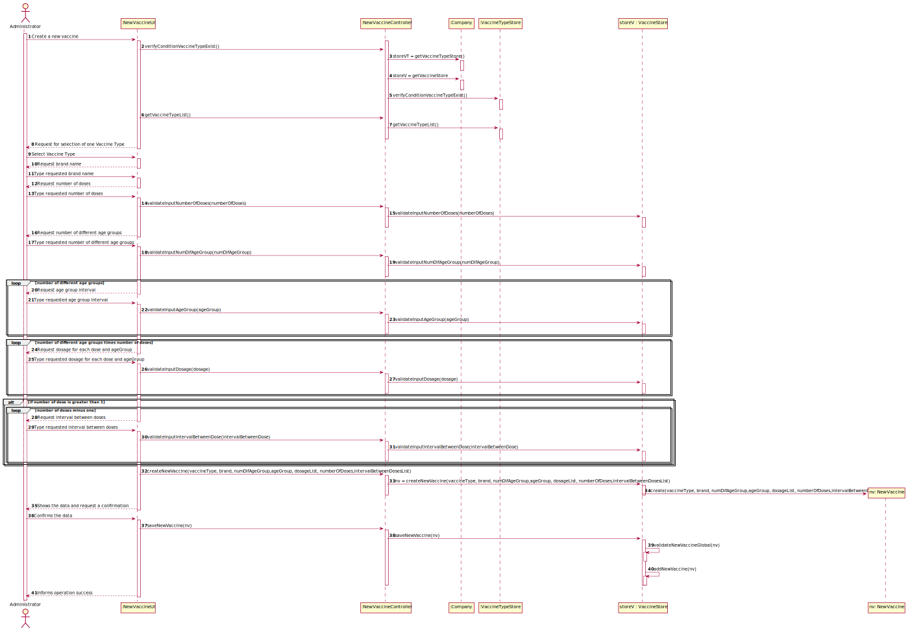
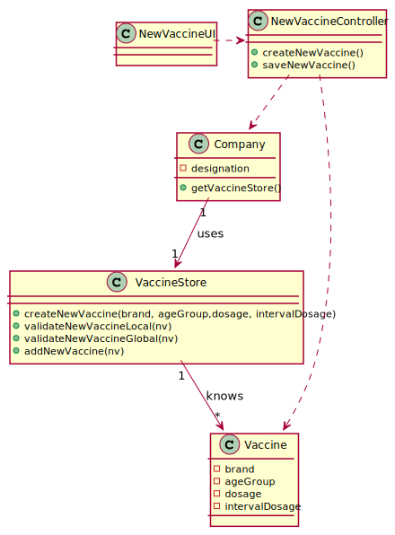

# US 013 - Administrator: Specify a new vaccine

## 1. Requirements Engineering

### 1.1. User Story Description

* As an administrator, I intend to specify a new vaccine and its administration process
 
  ### 1.1.2 Primary Actor
  * Administrator

  ### 1.1.3 Stakeholders and interests
  * Administrator: Wants to specify a new vaccine and its administration process.

  ### 1.1.3 Preconditions
  * Administrator is identified and authenticated.

### 1.2. Customer Specifications and Clarifications 

**From the specifications document:**

>"For instance, for the Covid-19 type, there is (i) the Pfizer vaccine, (ii) the Moderna vaccine, (iii) the Astra Zeneca vaccine, and so on."

>"The vaccine administration process comprises (i) one or more age groups (e.g.: 5 to 12 years old, 13 to 18 years  old, greater than 18 years old)"

>"Per age group, the doses to be administered (e.g.: 1, 2, 3)"

>"The vaccine dosage (e.g.: 30 ml)"

>"The time interval regarding the previously administered dose"

#### From the client clarifications:

> **Question:**
Dear client. When specifying a Vaccine and its Administration Process, are there any rules for the following attributes? 
> Name, 
> Id,
> Brand,
> Number of doses, 
> Dosage.
> 
>Best Regards

>
> **Answer:**
Dear student. During Sprint B I will not introduce attribute rules/formats other than the ones that I already introduced (in this forum or in the project description). Please study the concepts and define appropriate formats for the attributes. 
>
>Best regards, Carlos Ferreira

-

> **Question:**
Dear Client. 
> 
>[1] We would like to know if when specifying a new Vaccine and its Administration Process, should a list of the existing types of vaccines be displayed in order for him to choose one, or should he just input it? 
>
>[2]  Also, in the Vaccine Type what information should each type contain? 
> 
>Thank you for you time and attention in advance,

> **Answer:** Dear student,
> 
>1- If the information is available in the system, it is a good practice to present the information to the user and ask the user to select;
>
>2- I already answered this question.

-

> **Question:**
Dear Client,
>
>As to the interval between doses, what time format are we to use? (e.g. days, weeks, months)
>
>Thank you

> **Answer:** Dear student,
>
>Dear student,
>
>Number of days.
> 
>Best regards,

### 1.3. Acceptance Criteria

*No Acceptance Criteria found.*

### 1.4. Found out Dependencies

*The specification of a new vaccine depends on the existence of a registered vaccine type*

### 1.5 Input and Output Data

**Input Data**

* Typed data:
    * Brand name
    * Number of doses
    * Number of different age groups
    * Age groups
    * Vaccine dosage
    * interval between each dose

* Selected data: 
  * Vaccine Type

**Output**

* (In)Success of the operation

### 1.6. System Sequence Diagram (SSD)

### 1.7 Other Relevant Remarks

*Use this section to capture other relevant information that is related with this US such as (i) special requirements ; (ii) data and/or technology variations; (iii) how often this US is held.* 

## 2. OO Analysis

### 2.1. Relevant Domain Model Excerpt 

### 2.2. Other Remarks

*Use this section to capture some aditional notes/remarks that must be taken into consideration into the design activity. In some case, it might be usefull to add other analysis artifacts (e.g. activity or state diagrams).* 

## 3. Design - User Story Realization 

### 3.1. Rationale

| Interaction ID | Question: Which class is responsible for... | Answer  | Justification (with patterns)  | 
|:-------------  |:--------------------- |:------------|:---------------------------- |
|        		 |Interacting with the actor?|SpecifyNewVaccineUI| IE: responsible for user interaction|
| 			  	 |Coordinating the US?|SpecifyNewVaccineController|Coordinates or controls the flow of the user scenario| 
| 			  	 |Knowing the user using the system?|Company|Company know user| 
| Step 1: Create a new vaccine	 |Instantiating a new vaccine?|Company|Creator: R1/2. VaccineStore contains NewVaccine class objects|
| Step 2: Request for selection of one Vaccine Type  |n/a|| |
| Step 3: Select Vaccine Type |...saving the inputted data?|Vaccine|	IE: The object in step 1 has its own data|
| Step 4: Request brand name |n/a|| |
| Step 5: Type requested brand name |...saving the inputted data?|Vaccine|	IE: The object in step 1 has its own data|
| Step 6: Request number of doses |n/a|| |
| Step 7: Type requested number of doses |...saving the inputted data?|Vaccine| IE: The object in step 1 has its own data|
| Step 8: Request number of different age groups |n/a|| |
| Step 9: Type requested number of different age groups  |...saving the inputted data?|Vaccine|	IE: The object in step 1 has its own data|
| Step 10: Request age group interval |n/a|| |
| Step 11: Type requested age group interval |Saving the input data?|Vaccine|IE: The object created in step 1 has its own data.|
| Step 12: Request dosage for each dose and ageGroup |n/a|| |
| Step 13: Type requested dosage for each dose and ageGroup |...saving the inputted data?|Vaccine|	IE: The object in step 1 has its own data|
| Step 14: Request interval between doses |n/a|| |
| Step 15: Type requested interval between doses |...saving the inputted data?|Vaccine|	IE: The object in step 1 has its own data|
| Step 16: Shows the data and request a confirmation |Validate locally the new vaccine|Vaccine|IE: knows its own data|
|       	  	 |Validate globally the new vaccine|Company|VaccineStore knows all the Vaccine objects.|
| Step 17: Confirms the data |Saving the created new vaccine|Company|VaccineStore adopts/records all the Vaccine objects.|              
| Step 18: Informs operation success	|Informing operation success?|SpecifyNewVaccineUI |	IE: responsible for user interaction | 

### Systematization ##

According to the taken rationale, the conceptual classes promoted to software classes are: 

 * Company
 * Vaccine
 * VaccineStore

Other software classes (i.e. Pure Fabrication) identified: 
 * SpecifyNewVaccineUI  
 * SpecifyNewVaccineController

## 3.2. Sequence Diagram (SD)

*In this section, it is suggested to present an UML dynamic view stating the sequence of domain related software objects' interactions that allows to fulfill the requirement.* 

## 3.3. Class Diagram (CD)

*In this section, it is suggested to present an UML static view representing the main domain related software classes that are involved in fulfilling the requirement as well as and their relations, attributes and methods.*

# 4. Tests
**Test 1:** Check that it is not possible to create an instance of the Vaccine class with the brand blank value. 

	@Test
    void ensureBrandIsNotBlank(){
        try {
            VaccineStore vaccineStore = new VaccineStore();
            VaccineTypeStore store = new VaccineTypeStore();
            VaccineType vaccineType= store.createVaccineType("12345","description","mrna");
            ArrayList<Integer> agegroup = new ArrayList<>(Arrays.asList(1, 2, 3, 4));
            ArrayList<Integer> interval = new ArrayList<>(Arrays.asList(1));
            ArrayList<Double> dosage = new ArrayList<>(4);
            vaccineStore.createNewVaccine(vaccineType,"     ",2,agegroup,dosage,2,interval);
        }catch (IllegalArgumentException e){
            assertNotNull(e);
        }
    }

**Test 2:** Check that it is not possible to create an instance of the Vaccine class with a not correctly defined age group.

    @Test
    void ensureAgeGroupIsCorrectlyDefined() {
        try {
            VaccineStore vaccineStore = new VaccineStore();
            VaccineTypeStore store = new VaccineTypeStore();
            VaccineType vaccineType= store.createVaccineType("12345","description","mrna");
            ArrayList<Integer> agegroup = new ArrayList<>(Arrays.asList(1, 2, 3));
            ArrayList<Integer> interval = new ArrayList<>(Arrays.asList(1));
            ArrayList<Double> dosage = new ArrayList<>(4);
            vaccineStore.createNewVaccine(vaccineType,"pfizer",2,agegroup,dosage,2,interval);
        }catch (IllegalArgumentException e){
            assertNotNull(e);
        }
    }

**Test 3:** Check that it is not possible to create an instance of the Vaccine class with a number of doses smaller than one.

    @Test
    void ensureNumberOfDosesIsNotSmallerThanOne() {
        try {
            VaccineStore vaccineStore = new VaccineStore();
            VaccineTypeStore store = new VaccineTypeStore();
            VaccineType vaccineType= store.createVaccineType("12345","description","mrna");
            ArrayList<Integer> agegroup = new ArrayList<>(Arrays.asList(1, 2, 3, 4));
            ArrayList<Integer> interval = new ArrayList<>(Arrays.asList(1));
            ArrayList<Double> dosage = new ArrayList<>(2);
            vaccineStore.createNewVaccine(vaccineType,"pfizer",2,agegroup,dosage,0,interval);
        }catch (IllegalArgumentException e){
            assertNotNull(e);
        }
    }

*It is also recommended to organize this content by subsections.* 

# 5. Construction (Implementation)

## Class SpecifyVaccineController

    /**
    * Gets the "VaccineStore" first to after use it to create the object
    */

    public SpecifyVaccineController() {
        this.app = App.getInstance();
        storeV = app.getCompany().getVaccineStore();
    }

    /**
     * Method that checks if the object Vaccine Type exist, for the new Vaccine, in VaccineTypeStore.
    * Gets the "VaccineTypeStore" first and then uses it to verify the condition
    */

    public boolean verifyConditionVaccineTypeExist(){
        storeVT = app.getCompany().getVaccineTypeStore();
        return !storeVT.getVaccineTypeList().isEmpty();
    }

    /**
     * Method that obtain the object Vaccine Type List, for the new Vaccine, in VaccineTypeStore.
     */

    public ArrayList<VaccineType> getVaccineTypeList(){
        return storeVT.getVaccineTypeList();
    }

    /**
     * Method that checks if the parameter "numberOfDoses" of the new Vaccine is correctly defined in SpecifyVacinneUI
     * @param numberOfDoses int created
     * @return true/false boolean
     */

    public void createNewVaccine (VaccineType vaccineType ,String brand, int numDifAgeGroup ,ArrayList<Integer> ageGroup, ArrayList<Double> dosageList, int numberOfDoses, ArrayList<Integer> intervalBetweenDosesList){
        nv = storeV.createNewVaccine(vaccineType, brand, numDifAgeGroup,ageGroup, dosageList, numberOfDoses,intervalBetweenDosesList);
    }

    /**
     * Saves the new Vaccine in VaccineStore
     */

    public void saveVaccine(){
        storeV.saveVaccine(nv);
    }

## Class VaccineStore

    /**
     * Creates the object "Vaccine", verifying all the acceptance criteria.
     * @param vaccineType object VaccineType "Vaccine Type" selected by the user and obtained by the Class VaccineTypeStore
     * @param brand String "Brand" inputted by the user
     * @param numDifAgeGroup int "Number of Different Age Groups" inputted by the user
     * @param ageGroup ArrayList<Integer> "Age Groups List" inputted by the user
     * @param dosageList ArrayList<Double> "Dosages List" inputted by the user
     * @param numberOfDoses int "Number Of Doses" inputted by the user
     * @param intervalBetweenDosesList ArrayList<Integer> "List of Intervals Between Doses" inputted by the user
     * @return Vaccine object
     */

    public Vaccine createNewVaccine (VaccineType vaccineType, String brand, int numDifAgeGroup, ArrayList<Integer> ageGroup, ArrayList <Double> dosageList, int numberOfDoses, ArrayList <Integer> intervalBetweenDosesList){
        return new Vaccine(vaccineType,brand,numDifAgeGroup,ageGroup,dosageList,numberOfDoses,intervalBetweenDosesList);
    }

    /**
     * if validated, saves the Vaccine in the vaccineList
     * @param nv object Vaccine created
     */

    public void saveVaccine(Vaccine nv){
        validateVaccine(nv);
        addVaccine(nv);
    }

    /**
     * add the object Vaccine into the vaccineList
     * @param nv object Vaccine created
     */

    private void addVaccine(Vaccine nv) {
        this.vaccineList.add(nv);
    }

    /**
     * Checks if the object Vaccine "nv" of the new Vaccine already exists in vaccineTypeList
     * using the method "equals" to compare with all the Vaccine objects saved in vaccineTypeList
     * @param nv object Vaccine created
     */

    private void validateVaccine(Vaccine nv) {
        for (Vaccine nvCopy : vaccineList) {
            if (nvCopy.equals(nv)){
                throw new IllegalArgumentException("Couldn't save. This vaccine already exists");
            }
        }
    }

# 6. Integration and Demo

* A new option on the Admin menu options was added.

# 7. Observations

