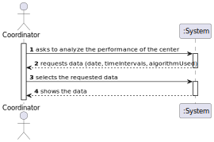
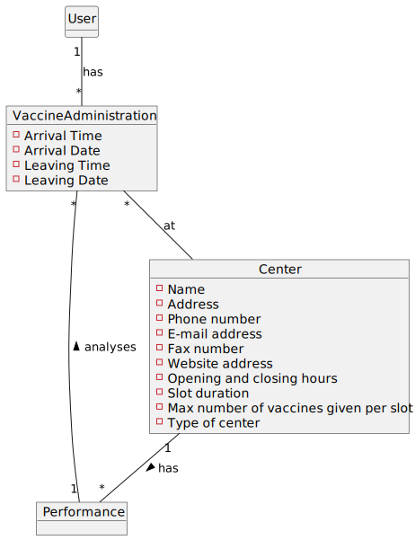
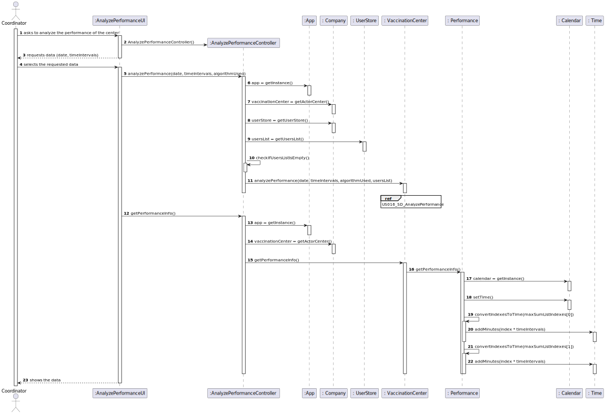
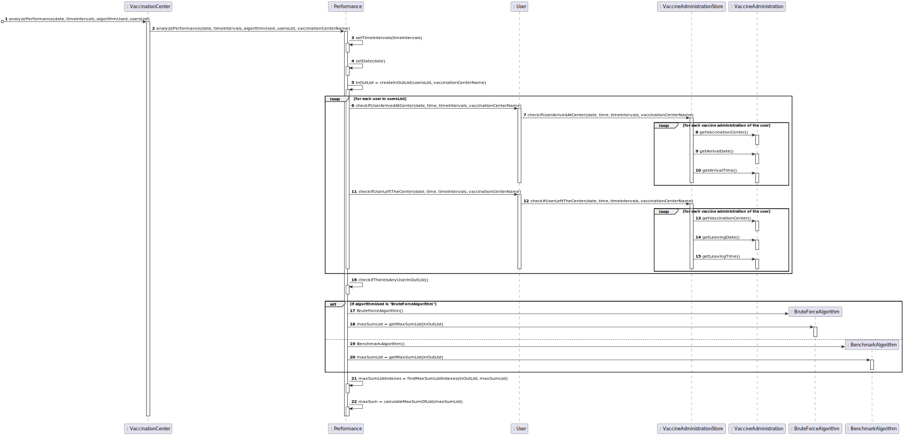
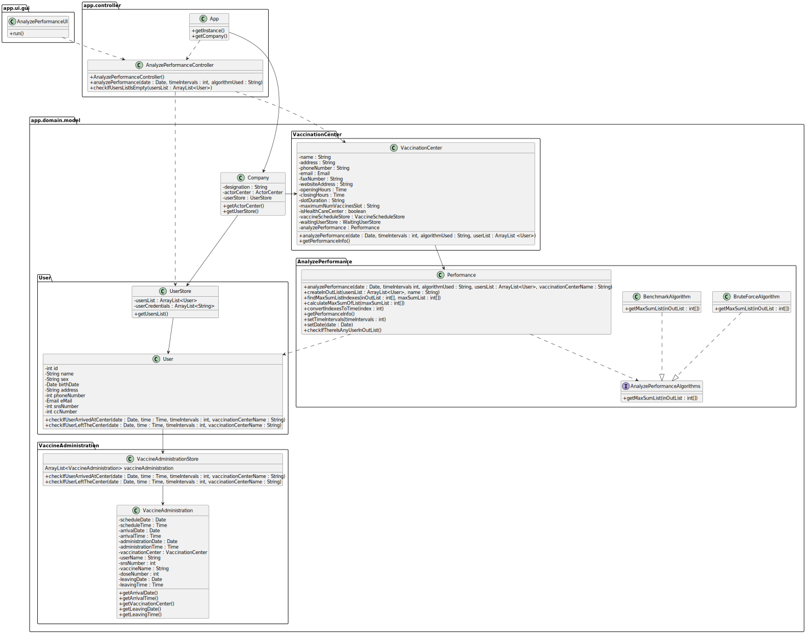

# US 016 - Coordinator : Analyze Performance of a Center

## 1. Requirements Engineering

### 1.1. User Story Description

As a center coordinator, I intend to analyze the performance of a center.

### 1.2. Customer Specifications and Clarifications 

**From the client clarifications:**

>**Question**: "From the Sprint D requirements it is possible to understand that we ought to implement a procedure that creates a list with the differences between the number of new clients arriving and the number of leaving clients for each time interval. My question then is, should this list strictly data from the legacy system (csv file from moodle which is loaded in US17), or should it also include data from our system?"

>**Answer**: "US 16 is for all the data that exists in the system."

**From teacher's clarifications:**

>**Question**: "Temos de ter duas opções de escolha, para que o utilizador escolha o algoritmo que quer correr (Algoritmo de Força Bruta e o Benchmark) ? "

> **Answer**:"Sim."

### 1.3. Acceptance Criteria

**AC1**: One sorting algorithm should be implemented and one is given(the coordinator should choose which sorting algorithm will be used).

### 1.4. Found out Dependencies

* Needs to exist a vaccine and vaccine type registered in the system.
* Needs to exist users in the system.
* Needs to exist vaccine administrations on the system.
* Needs to exist a coordinator registered in the system.
* Needs to exist a vaccination center in the system.
### 1.5 Input and Output Data

**Input Data:**

* Selected data:
    * Date
    * Time Intervals
    * Algorithm used
    
**Output Data:**
* Input list
* Max Sum list
* Sum
* Interval of time of the max sum list

### 1.6. System Sequence Diagram (SSD)

### 1.7 Other Relevant Remarks

* Blank

## 2. OO Analysis

### 2.1. Relevant Domain Model Excerpt 

### 2.2. Other Remarks

Special requirements:
* Worst-case time complexity of each algorithm should be documented in the application user manual (in the annexes) that must be delivered with the application

## 3. Design - User Story Realization 

### 3.1. Rationale

| Interaction ID                                                                                                                             | Question: Which class is responsible for...  | Answer                                              | Justification (with patterns)                                                                                  |
|:-------------------------------------------------------------------------------------------------------------------------------------------|:---------------------------------------------|:----------------------------------------------------|:---------------------------------------------------------------------------------------------------------------|
| Step 01 - Asks to analyze the performance of a center                                                                                      |	... interacting with the actor?             |  AnalyzePerformanceUI                               |  Pure Fabrication                                                                                              |
| 			                                                                                                                                 |	... coordinating the US?                    |  VaccineScheduleController                          |  Pure Fabrication                                                                                              |
| Step 02 - Requests data (date, time intervals, used algorithm)	                                                                         |	n/a         			                    |                                                     |                                                                                                                |
| Step 03 - Selects the requested data		                                                                                                 |	... saving the inputted data?               |  Performance                                        |  IE: The object knows its own data                                                                             |
| 			                                                                                                                                 |	... analyzing the performance of a center   |  Performance/BruteForceAlgorithm/BenchmarkAlgorithm |  IE: The object knows its own data                                                                             |
| Step 04 - Shows the data                                                                                                                   |	... showing the data?                       |  AnalyzePerformanceUI                               |  IE: responsible for user interaction                                                                          |

### Systematization ##

According to the taken rationale, the conceptual class promoted to software class is: 

* Performance

Other software classes (i.e. Pure Fabrication) identified: 

* AnalyzePerformanceController
* AnalyzePerformanceUI
* Company

## 3.2. Sequence Diagram (SD)

## 3.3. Class Diagram (CD)

# 4. Tests 

**Test 1:** Check if it is possible to analyze the performance with no user registered in the system

    @Test
    void checkIfUsersListIsEmpty() {
        AnalyzePerformanceController controller = new AnalyzePerformanceController();
        ArrayList<User> userList  = new ArrayList<>();
        String expectedMessage = "UsersList";
        try {
            controller.checkIfUsersListIsEmpty(userList);
        } catch (ListIsEmptyException e) {
            assertTrue(expectedMessage.contains(e.getMessage()));
        }
    }

**Test 2:** Check if it is analyzing correctly

    @Test
    void getMaxSumList() {

        BruteForceAlgorithm bruteForceAlgorithm = new BruteForceAlgorithm();
        int[] inOutList = new int[]{242, 194, 241, 92, 53, 27, 74, -75, -357, -125, -29, 141, 269, 121, 50, 26, -29, -118, -254, 89, 246, -20, -119, -322};
        int[] expectedOutputList = new int[]{242, 194, 241, 92, 53, 27, 74, -75, -357, -125, -29, 141, 269, 121, 50, 26};

        assertEquals(Arrays.toString(bruteForceAlgorithm.getMaxSumList(inOutList)), Arrays.toString(expectedOutputList));
    }

# 5. Construction (Implementation)

## Class AnalyzePerformanceController

    public void analyzePerformance(Date date, int timeIntervals, String algorithmUsed) throws ListIsEmptyException {
        App app = App.getInstance();
        VaccinationCenter vaccinationCenter = app.getCompany().getActorCenter();
        UserStore userStore = app.getCompany().getUserStore();

        ArrayList<User> usersList = userStore.getUsersList();
        checkIfUsersListIsEmpty(usersList);

        vaccinationCenter.analyzePerformance(date, timeIntervals, algorithmUsed, usersList);
    }

    public String getPerformanceInfo() {
        App app = App.getInstance();
        VaccinationCenter vaccinationCenter = app.getCompany().getActorCenter();

        return vaccinationCenter.getPerformanceInfo();
    }

    public void checkIfUsersListIsEmpty(ArrayList<User> usersList) throws ListIsEmptyException {
        if (usersList.isEmpty()) {
            throw new ListIsEmptyException("UsersList");
        }
    }

## Class Performance
    public void analyzePerformance(Date date, int timeIntervals, String algorithmUsed, ArrayList<User> usersList, String vaccinationCenterName) throws ListIsEmptyException {
        numberOfTimeIntervals = MINUTES_OF_WORK / timeIntervals;
        setTimeIntervals(timeIntervals);
        setDate(date);
        inOutList = createInOutList(usersList, vaccinationCenterName);
        checkIfThereIsAnyUserInOutList();
        if(algorithmUsed.equals("Brute Force Algorithm")) {
            BruteForceAlgorithm bruteForceAlgorithm = new BruteForceAlgorithm();
            maxSumList = bruteForceAlgorithm.getMaxSumList(inOutList);
        }else{
            BenchmarkAlgorithm benchmarkAlgorithm = new BenchmarkAlgorithm();
            maxSumList = benchmarkAlgorithm.getMaxSumList(inOutList);
        }
        maxSumListIndexes = findMaxSumListIndexes(inOutList, maxSumList);
        maxSum = calculateMaxSumOfList(maxSumList);

    }

    public int[] createInOutList(ArrayList<User> usersList, String vaccinationCenterName){
        int arrivals;
        int departures;
        int[] inOutList = new int[numberOfTimeIntervals];
        for (int i = 0; i < numberOfTimeIntervals; i++) {
            arrivals = 0;
            departures = 0;
            for (User user : usersList) {
                if (user.checkIfUserArrivedAtCenter(date, openingTime.addMinutes(i * timeIntervals), timeIntervals, vaccinationCenterName)) {
                    arrivals++;
                }
                if (user.checkIfUserLeftTheCenter(date, openingTime.addMinutes(i * timeIntervals), timeIntervals, vaccinationCenterName)) {
                    departures++;
                }
            }
            inOutList[i] = arrivals - departures;
        }
        return inOutList;
    }
  
    public int[] findMaxSumListIndexes(int[] inOutList, int[] maxSumList){
        int j = 0;
        int counter = 0;
        int maxSumStart = -1;
        int [] maxSumListIndexes = new int[2];
        for (int i = 0; i < inOutList.length; i++) {
            if(inOutList[i] == maxSumList[j]) {
                j++;
                counter++;
                if(counter == 1)
                    maxSumStart = i;

                if(counter == maxSumList.length){
                    maxSumListIndexes[0] = maxSumStart;
                    maxSumListIndexes[1] = i;
                    return maxSumListIndexes;
                }
            }else{
                j = 0;
                counter = 0;
                maxSumStart = -1;
            }
        }
        maxSumListIndexes[0] = -1;
        maxSumListIndexes[1] = -1;
        return maxSumListIndexes;
    }

    public int calculateMaxSumOfList(int[] maxSumList) {
        int sum = 0;
        for (int j : maxSumList) {
            sum += j;
        }
        return sum;
    }
    
    public Time convertIndexesToTime(int index){
        return openingTime.addMinutes(index * timeIntervals);
    }

    public String getPerformanceInfo(){
        Calendar calendar = Calendar.getInstance();
        calendar.setTime(date);
        return String.format(" %s\n%s \n\n%s\n%s \n\n%s%d \n\n%s%d%s%d%s%d%s%s%s%d%s%d%s%d%s%s%s"
                ,"Input List:", Arrays.toString(inOutList)
                ,"Max sum sublist of output:",Arrays.toString(maxSumList)
                , "Sum: ",maxSum
                , "Time interval: [",calendar.get(Calendar.DAY_OF_MONTH), "/", (calendar.get(Calendar.MONTH)+1), "/", calendar.get(Calendar.YEAR), " "
                , convertIndexesToTime(maxSumListIndexes[0]), ", "
                ,calendar.get(Calendar.DAY_OF_MONTH), "/", (calendar.get(Calendar.MONTH)+1), "/", calendar.get(Calendar.YEAR) , " "
                , convertIndexesToTime(maxSumListIndexes[1]+1), "]");
    }

# 6. Integration and Demo
* Empty
# 7. Observations
* Empty

