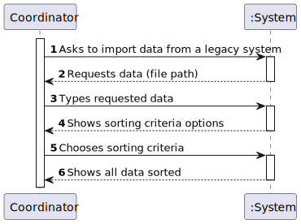
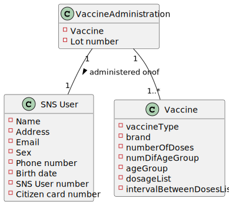
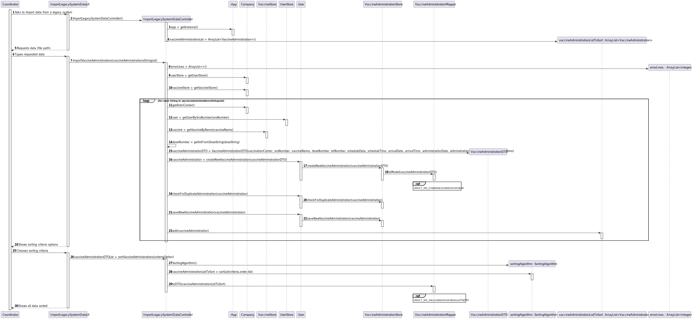
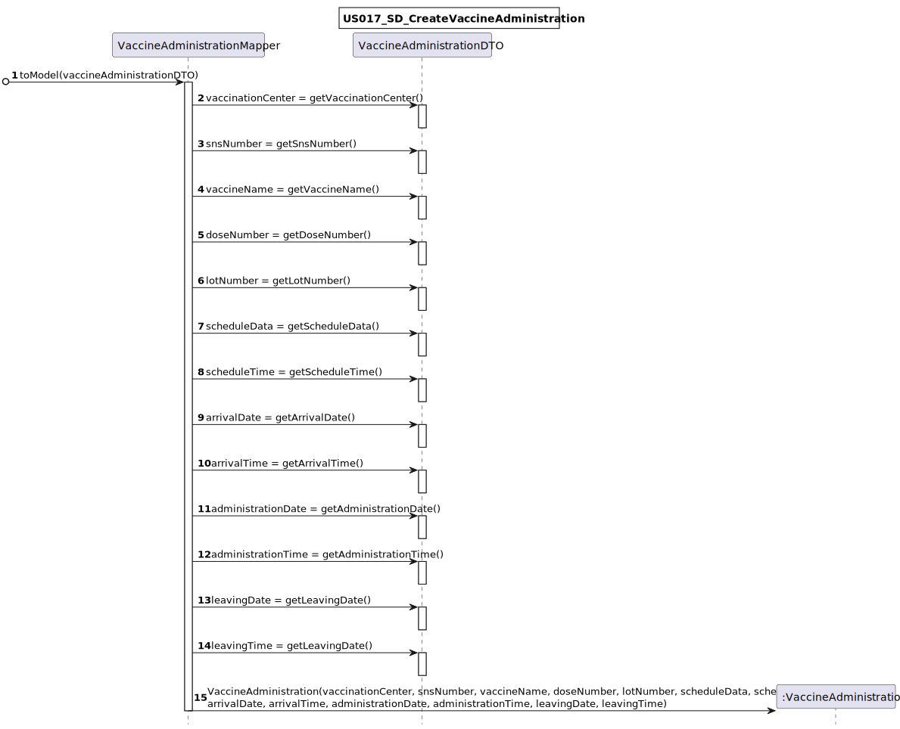
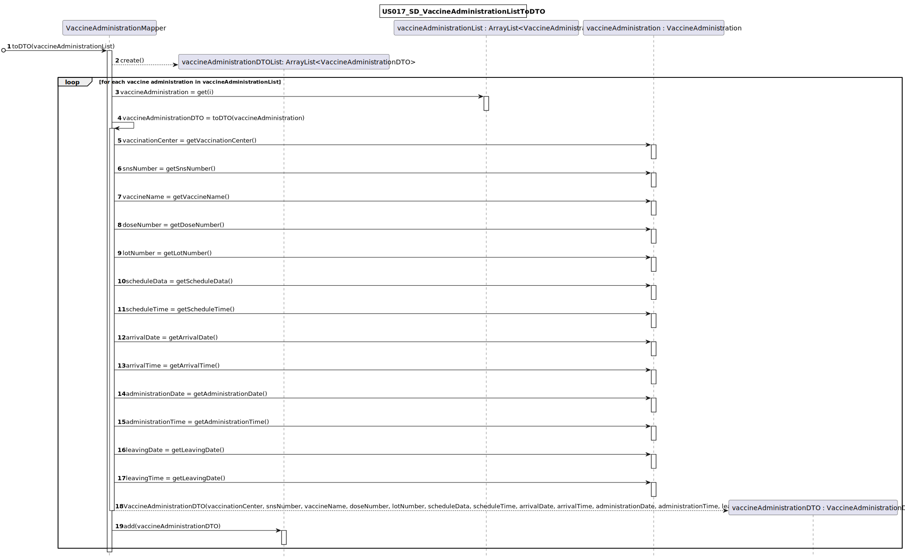
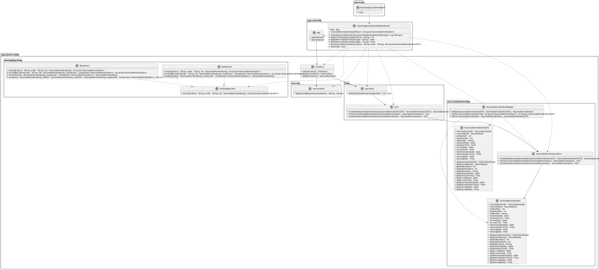

# US 017 - Coordinator : Import data from a legacy system 

## 1. Requirements Engineering

### 1.1. User Story Description

US17: As a center coordinator, I want to import data from a legacy system that was used in the past to manage centers. The imported data should be presented to the user sorted by arrival time or by the center leaving time. The name of the SNS user and the vaccine type Short Description attribute should also be presented to the user.

### 1.2. Customer Specifications and Clarifications

From the document :
> "The user should introduce his/her SNS user number, select the vaccination center, the date, and the time (s)he wants  to  be  vaccinatedas  well  as  the  type  of  vaccine  to  be  administered  (by default, the system suggests  the  one related  to the  ongoing  outbreak).Then,  the  application  should  check  the vaccination  center  capacity  for  that  day/timeand,  if  possible,  confirm  that  the  vaccination  is scheduled  and  inform  the  user  that (s)he  should  be  at  the  selected  vaccination  center  at  the scheduled  day  and  time.  The  SNS user may also authorize the DGS to send a SMS message with information  about  the  scheduled  appointment.  If  the  user  authorizes  the  sending of the SMS, the application should send an SMS message when the vaccination event is scheduled and registered in the system."

From the client :
>**Question**: "In the Sprint D requirements is stated that two sorting algorithms should be implemented and that the imported data should be sorted by arrival time or center leaving time. Should each algorithm be capable of both sortings or is one of the algorithms supposed to do one (e.g. arrival time) and the other the remaining sorting criteria (e.g. leaving time)?"

>**Answer**: Each algorithm should be capable of doing both . The application should be prepared to run both algorithms. The algorithm that will be used to sort data should be defined in a configuration file.

>**Question**: It should be an option to choose to either sort by arrival time or by the center leaving time?

>**Answer**: The user can choose to sort by arrival time or by the center leaving time.

>**Question**:"I was analysing the csv file that should be imported for US17 (the one that is in moodle), I noticed that the date attributes are written like this 5/30/2022 I thought that the date format should be DD/MM/YYYY. I also noticed, that the time is written like this, 9:43, I also thought that the time format should be written like this HH:MM, (in this case it would be 09:43). Are the date and time formats different for US17?" 

>**Answer** : That file is from a legacy system, that uses a different date and time format. The date and time should be converted when loading the data into the application that we are developing.

### 1.3. Acceptance Criteria

**AC1**: Two sorting algorithms should be implemented (to be chosen manually by the coordinator). 
**AC2**: The center coordinator must be able to choose the file that is to be uploaded.

### 1.4. Found out Dependencies
* US010 : There needs to exist a coordinator registered in the system
* US008 : There needs to exist a vaccination center in the system

### 1.5 Input and Output Data

* Input:
  * File with all data
  * Criteria, order and algorithm to sort data by
* Output:
  * Sorted data

### 1.6. System Sequence Diagram (SSD)

### 1.7 Other Relevant Remarks

Special requirements:
* Worst-case time complexity of each algorithm should be documented in the application user manual (in the annexes) that must be delivered with the application

## 2. OO Analysis

### 2.1. Relevant Domain Model Excerpt

### 2.2. Other Remarks

## 3. Design - User Story Realization

### 3.1. Rationale

**The rationale grounds on the SSD interactions and the identified input/output data.**

| Interaction ID | Question: Which class is responsible for... | Answer  | Justification (with patterns)  |
|:-------------  |:--------------------- |:------------|:---------------------------- |
| Step 1 - Asks to import data from a legacy system | ... interacting with the actor?        |  ImportLegacySystemDataUI          |  Pure Fabrication                                      |
| 			                                        | ... coordinating the US?               |  ImportLegacySystemDataController  |  Pure Fabrication                                      |
| Step 2 - Requests data (file path)	            | n/a                                    |                                    |                                                        |
| Step 3 - Types requested data 		            | ... importing file data?               | ImportLegacySystemDataUI           | IE: The UI is responsible for input/output operations  |
| 			                                        | ... saving the data from the file?     | VaccineAdministration              | IE: The object knows its own data                      |
| Step 4 - shows sorting criteria options	        | n/a                                    |                                    |                                                        |
| Step 5 - Chooses sorting criteria 		        | ...saving the inputted option?         | ImportLegacySystemDataController   | IE : It needs to know what order to use                |
| Step 6 - shows sorting order options 	            | n/a                                    |                                    |                                                        |              
| Step 7 - Chooses sorting order 		            | ...saving the inputted option?         | ImportLegacySystemDataController   | IE : It needs to know what criteria to use             |
| Step 8 - Shows all data sorted 		            | ...output data?                        | ImportLegacySystemDataUI           | IE : UI is responsible for user interaction            |

### Systematization ##

According to the taken rationale, the conceptual classes promoted to software classes are:

* VaccineAdministration

Other software classes (i.e. Pure Fabrication) identified:
* ImportLegacySystemDataUI
* ImportLegacySystemDataController

## 3.2. Sequence Diagram (SD)

## 3.3. Class Diagram (CD)

# 4. Tests

**Test 1:** Check that merge sort correctly sorts the array.
    
    @Test
	void sortListLeaving() throws ParseException {
        VaccinationCenter vc = new VaccinationCenter("fgfgf", "w", "121212121", "w@w.com", "121212121", "w.com", "10:00", "20:00", "5", "10", true);
        ArrayList<Integer> ageGroup = new ArrayList<>(Arrays.asList(1, 2, 3, 4));
        ArrayList<Integer> interval = new ArrayList<>(Arrays.asList(1));
        ArrayList<Double> dosage = new ArrayList<>(Arrays.asList(1.2,3.4,5.6,6.7));
        Vaccine v = new Vaccine(new VaccineTypeDTO("12345","a","mrna"),"pfizer",2,ageGroup,dosage,2,interval);

        SimpleDateFormat df = new SimpleDateFormat("dd-MM-yyyy");
        Date date = df.parse("10-10-2022");
        VaccineAdministration va1 = new VaccineAdministration(vc,v,111111111,1,"12345-12","AAAA",date,new Time("8:00"), date,new Time("8:00"), date, new Time("8:15"), date, new Time("8:45"));
        VaccineAdministration va2 = new VaccineAdministration(vc,v,222222222,1,"12345-12","BBBB",date,new Time("8:00"), date,new Time("8:01"), date, new Time("8:16"), date, new Time("8:46"));
        VaccineAdministration va3 = new VaccineAdministration(vc,v,333333333,1,"12345-12","CCCC",date,new Time("8:00"), date,new Time("8:02"), date, new Time("8:17"), date, new Time("8:47"));
        VaccineAdministration va4 = new VaccineAdministration(vc,v,444444444,1,"12345-12","DDDD",date,new Time("8:00"), date,new Time("8:03"), date, new Time("8:18"), date, new Time("8:48"));

        VaccineAdministration[] list = {va2,va1,va4,va3};
        VaccineAdministration[] expectedArray = {va1, va2, va3, va4};
        ArrayList<VaccineAdministration> expectedList= new ArrayList<>(List.of(expectedArray));
        MergeSort alg = new MergeSort();
        ArrayList<VaccineAdministration> obtainedList = alg.sortList("leaving","ascending",list);

        assertEquals(obtainedList,expectedList);
    }

**Test 2:** Check that bubble sort correctly sorts the array.
    
    @Test
    void sortListArrival() throws ParseException {
        VaccinationCenter vc = new VaccinationCenter("fgfgf", "w", "121212121", "w@w.com", "121212121", "w.com", "10:00", "20:00", "5", "10", true);
        ArrayList<Integer> ageGroup = new ArrayList<>(Arrays.asList(1, 2, 3, 4));
        ArrayList<Integer> interval = new ArrayList<>(Arrays.asList(1));
        ArrayList<Double> dosage = new ArrayList<>(Arrays.asList(1.2,3.4,5.6,6.7));
        Vaccine v = new Vaccine(new VaccineTypeDTO("12345","a","mrna"),"pfizer",2,ageGroup,dosage,2,interval);

        SimpleDateFormat df = new SimpleDateFormat("dd-MM-yyyy");
        Date date = df.parse("10-10-2022");
        VaccineAdministration va1 = new VaccineAdministration(vc,v,111111111,1,"12345-12","AAAA",date,new Time("8:00"), date,new Time("8:00"), date, new Time("8:15"), date, new Time("8:45"));
        VaccineAdministration va2 = new VaccineAdministration(vc,v,222222222,1,"12345-12","BBBB",date,new Time("8:00"), date,new Time("8:01"), date, new Time("8:16"), date, new Time("8:46"));
        VaccineAdministration va3 = new VaccineAdministration(vc,v,333333333,1,"12345-12","CCCC",date,new Time("8:00"), date,new Time("8:02"), date, new Time("8:17"), date, new Time("8:47"));
        VaccineAdministration va4 = new VaccineAdministration(vc,v,444444444,1,"12345-12","DDDD",date,new Time("8:00"), date,new Time("8:03"), date, new Time("8:18"), date, new Time("8:48"));

        VaccineAdministration[] list = {va2,va1,va4,va3};
        VaccineAdministration[] expectedArray = {va1, va2, va3, va4};
        ArrayList<VaccineAdministration> expectedList= new ArrayList<>(List.of(expectedArray));
        BubbleSort alg = new BubbleSort();
        ArrayList<VaccineAdministration> obtainedList = alg.sortList("arrival","ascending",list);

        assertEquals(obtainedList,expectedList);
    }

# 5. Construction (Implementation)
Example: Bubble Sort 

    public class BubbleSort implements SortingAlgorithms{

    /**
     * Sorts an Array by criteria and order
     * @param criteria what the array should be sorted by (in this case, by arrival or leaving time)
     * @param order in what order, ascending or descending, should the array be sorted by
     * @param list array to be sorted
     * @return sorted list
     */
    @Override
    public ArrayList<VaccineAdministration> sortList(String criteria, String order, VaccineAdministration[] list) {
        if(criteria.equalsIgnoreCase("arrival")){
            ArrivalTimeComparator comparator = new ArrivalTimeComparator();
            return sortListByCriteria(order,list, comparator);
        }else {
            LeavingTimeComparator comparator = new LeavingTimeComparator();
            return sortListByCriteria(order,list,comparator);
        }
    }

    /**
     * Sorts the array utilizing the comparator
     * @param order in what order, ascending or descending, should the array be sorted by
     * @param list array to be sorted
     * @param comparator defines the object´s comparation criteria
     * @return sorted list
     */
    private ArrayList<VaccineAdministration> sortListByCriteria(String order, VaccineAdministration[] list, Comparator<VaccineAdministration> comparator){
        VaccineAdministration[] ascArray = bubbleSort(list, comparator);
        ArrayList<VaccineAdministration> ascList= new ArrayList<>(List.of(ascArray));

        if (order.equalsIgnoreCase("Descending")) {
            Collections.reverse(ascList);
        }
        return ascList;

    }

    /**
     * Examining each set of adjacent elements in the array, from left to right, switching their positions if they are out of order
     * @param list array to be sorted
     * @param comparator defines the object´s comparation criteria
     * @return sorted list
     */
    private VaccineAdministration[] bubbleSort(VaccineAdministration[] list, Comparator<VaccineAdministration> comparator) {
        int n = list.length;
        for (int i = 0; i < n - 1; i++){
            for (int j = 0; j < n - i - 1; j++){
                if (comparator.compare(list[j],list[j+1]) > 0) {
                    VaccineAdministration temp = list[j];
                    list[j] = list[j + 1];
                    list[j + 1] = temp;
                }
            }
        }
        return list;
    }

    }

    

# 6. Integration and Demo

# 7. Observations
